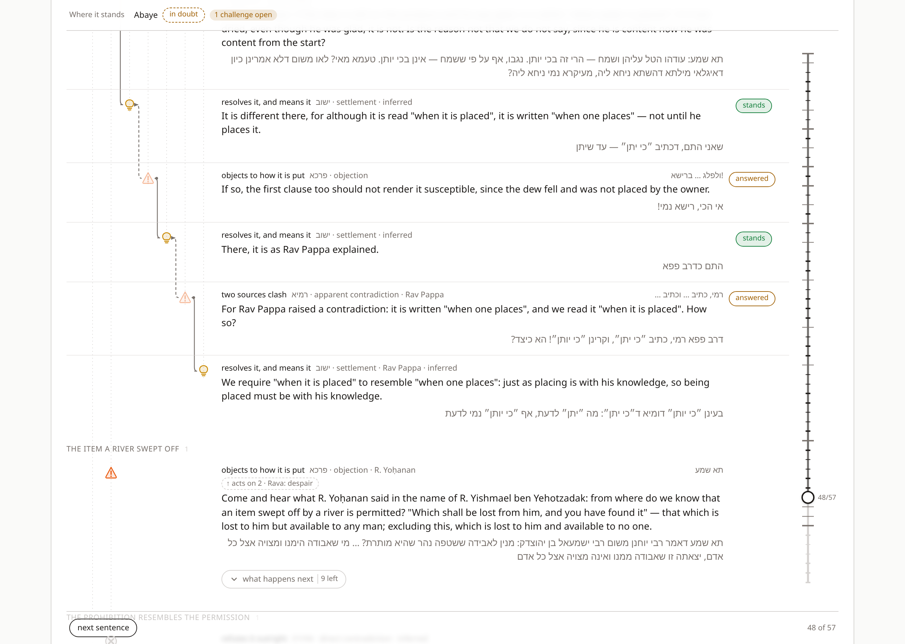
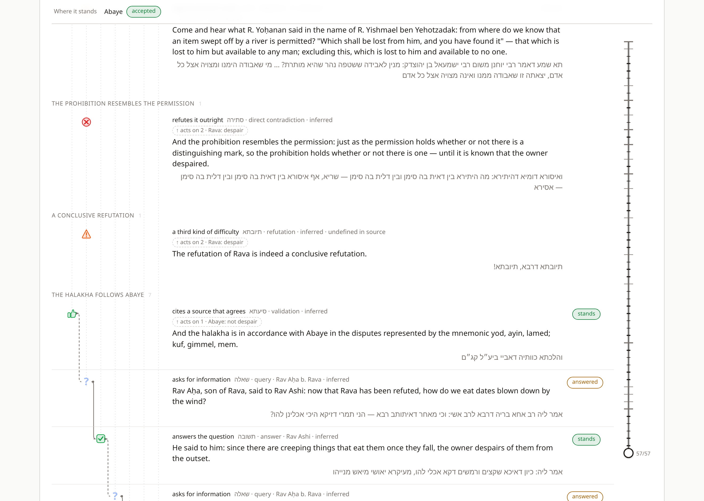

# Sugya Waterfall at Scale — v2

**What breaks when the passage is fifty-seven sentences instead of four, and what
had to change.** A companion to `SUGYA_WATERFALL_VISUALIZATION_V1.md`, which
should be read first: this document assumes its taxonomy, its model, and its
vocabulary, and only records what the v1 design could not survive.

The test case is `יאוש שלא מדעת` — Bava Metzia 21b–22b. Fifty-seven moves,
eighteen movements, seven levels deep, and a conclusion the Talmud states in its
own words, which makes it checkable. It is now `site/src/rail/fixtures/bava-metzia-yeush.ts`.

---

## 0. The short version

Nine things broke. Five were presentation and had straightforward fixes. Two were
bugs in the model that a four-sentence passage structurally cannot expose. Two are
gaps in Ramchal's taxonomy that only a whole sugya reaches, and those are not
fixed, because fixing them would mean inventing categories the book does not have.

| | What broke | Where |
|---|---|---|
| 1 | Attackers were folded in sequence, so the outcome depended on the order they were written in | §2.1 — **model bug, fixed** |
| 2 | The verdict badge stops moving; `doubt` for fifty consecutive sentences | §2.2 — **model gap, addressed** |
| 3 | `תיובתא`'s placeholder effect is contradicted by the Talmud's own usage | §4.1 — **gap, left open on purpose** |
| 4 | No leaf exists for `והלכתא` — the ruling that ends the debate | §4.2 — **gap, left open on purpose** |
| 5 | The depth columns became a cage over five thousand pixels of canvas | §3.1 — fixed |
| 6 | Thirteen moves landing on one claim drew their elbows in one gutter, as a single opaque stripe | §3.2 — fixed |
| 7 | Indent grew linearly and ate a quarter of the page | §3.3 — fixed |
| 8 | The rail was taller than the viewport, so its thumb could not be reached or dragged | §3.4 — fixed |
| 9 | Fifty blurred rows below the frontier: four thousand pixels of scroll nobody can read | §3.5 — fixed |

Everything in v1's Part I — the closed enum, the citation discipline, the
marker lexicon, prefix-as-sugya — survived unchanged and is why the rest was
tractable. The model's central claims held: the passage ends with Rava `rejected`
and Abaye `accepted`, which is what the Talmud says, and it gets there by the same
mechanism as the four-sentence Pesachim fixture.

---

## 1. Choosing the passage

The brief was a big, hard one. The constraints that actually mattered:

**It has to state its own verdict.** Every v1 fixture is checkable because
Ramchal labels it himself. He quotes nothing this long, so that check is gone —
see §5. What replaces it is a sugya that announces its own outcome:
`תיובתא דרבא, תיובתא` and then `והלכתא כוותיה דאביי`. Those are two hard
assertions the model either reproduces or fails, and `check.ts` now asserts both.

**It has to be wide and deep, not just long.** A long mishnah is fifty sentences
with no dialectic and would have tested nothing but scrolling. *Yeush shelo
mida'at* is thirteen successive `תא שמע` challenges against one dispute, each
answered, several of them opening sub-threads four and five deep. That shape —
very wide at depth 1, locally deep — is what broke the layout, and it is the
normal shape of a sugya rather than a pathological one.

**It has to exercise leaves the v1 fixtures never touched.** v1's Part IX asked
for passages using `אבעיא`, `פשיטות`, `סיעתא` and the `statement` subtypes. This
one uses all of them: Rav Aḥa's closing exchange with Rav Ashi alone supplies
`שאלה`, `תשובה`, `אבעיא` and `פשיטות` in four consecutive sentences.

Text came from the Sefaria API (`/api/v3/texts/Bava_Metzia.21b`), William
Davidson / Koren–Steinsaltz edition, Hebrew and English. The English is abridged
in the fixture: Steinsaltz's bracketed expansion makes one sentence carry three
moves, and each unit has to be one move.

> **Transferable rule.** A scale test is only worth building if it can fail
> visibly. Pick the long passage that states its own conclusion, not the longest
> one you can find.

---

## 2. What was wrong with the model

### 2.1 Attacks were folded in sequence, and order mattered

v1's Part IX lists this under known limits: *"Attacks are unordered within a
unit. All incoming moves are folded together; two attackers arriving in different
orders give the same result. Whether that is right is untested against the text."*

It is not right, and it is not what the code did. `analyze` folded incoming moves
left to right with `reduceStatus`, so each attacker overwrote the last:

```
doubt --unsettle--> doubt --unsettle--> doubt --reject--> rejected --unsettle--> doubt
doubt --unsettle--> doubt --unsettle--> doubt --unsettle--> doubt --reject--> rejected
```

Same four moves, different order, different verdict. This cannot show up in a
four-sentence passage, because nothing there has more than one move landing on
it. In Bava Metzia four moves land on Rava, and the last of them is the
`תיובתא` — whose effect is the placeholder `unsettle`. **Under the v1 fold, the
sentence that announces Rava's refutation would have erased it**, and the sugya
would have ended with Rava in doubt.

The fix decides by precedence over the whole set instead of folding:

```ts
const resolveStatus = (base: Status, incoming: readonly Incoming[]): Status => {
  const live = acting(incoming);                       // spent moves deliver nothing
  if (hasFull(live, "reject")) return "rejected";      // a סתירה is decisive
  if (live.some(unsettles)) return "doubt";            // any live objection, or a weakened one
  if (hasFull(live, "raise")) return "accepted";
  return base;
};
```

`resolveStanding` is the same shape: `reject` over `discharge` over `unsettle`.
All four v1 fixtures pass unchanged, because with one attacker a fold and a
precedence rule agree. `check.ts` now reverses the three closing moves on Rava
and asserts the verdict does not move.

The precedence is a reading and is worth stating: a live `סתירה` beats everything,
because Ramchal treats it as landing `לחלוטין` (Heb p177); a live `raise` does not
survive a live `unsettle`, because doubt is the resting state.

> **Transferable rule.** A limit recorded as "untested" in a design document is a
> bug waiting for a fixture large enough to reach it. The order in which
> contributions are combined is a real semantic decision, not an implementation
> detail, and combining by fold quietly picks "last writer wins".

### 2.2 The verdict badge stops carrying information

Doubt is the resting state (Ch8 p112). Abaye's claim is asserted, so it starts in
doubt; every challenge pushes it to doubt; every answer returns it to doubt.
Traced across all fifty-seven prefixes, the headline verdict reads:

```
step  1–50   in doubt
step    51   accepted
```

One transition in fifty-one steps. The pill is correct and it is useless — the
whole argument happens while it says nothing. This is not a bug in the reducer;
it is what happens when a genuinely contested claim is argued over for two folios.

What actually moves is how many objections are standing at any moment:

```
 2  Rava's דחיה lands                    1 challenge open
 7  תא שמע: scattered produce             2 open
 8  Rav Ukva bar Ḥama answers it          1 open
 9  תא שמע: scattered coins               2 open
...                                       (thirteen times)
49  the סתירה refutes Rava                0 open
51  והלכתא כוותיה דאביי                   accepted
```

So `Analysis` gained `pressure` — incoming moves that still exert force, per
unit — and the "where it stands" strip reports it beside the verdict. It is fully
derived; nothing new is stored. In a four-sentence passage it is always 0 or 1 and
adds nothing, which is why it was not missed.

> **Transferable rule.** A summary that is correct at one scale can be vacuous at
> another. Before adding a feature to make a long view legible, check whether the
> existing summary still varies over the data — if it does not, the fix is a
> different summary, not a bigger one.

---

## 3. What was wrong with the drawing

### 3.1 The depth columns became a cage

`ConnectorLayer` drew one dotted vertical per depth, from `y=0` to the full height
of the stage. At four rows and depth 3 that is four faint guides over 400px, and
it reads as structure. At fifty-seven rows and depth 7 it is eight dotted lines
over five thousand pixels, almost all of it past the last row that sits at those
depths. It reads as a cage, and it is what the canvas looks like before anything
else goes wrong.

Each column is now drawn only across the rows that inhabit it:

```ts
export type DepthColumn = { readonly x: number; readonly top: number; readonly bottom: number };
```

The deep columns become short local marks beside the one thread that goes deep,
which is both quieter and more informative — the guide now tells you *where* the
argument got deep.

### 3.2 Thirteen elbows in one gutter

This was the worst of them, and it is a correctness problem rather than an
aesthetic one. `connectorPath` runs its vertical leg in the gutter between two
depth columns (`from.x + indent / 2`) — deliberately, so a connector can never
cross an icon. Every move that lands on Abaye is at depth 1, so **every one of the
thirteen challenges draws its vertical in the same gutter**, from Abaye's icon
down to its own row. They overdraw into one opaque stripe four thousand pixels
long. Dashed and solid become indistinguishable; all thirteen arrowheads land on
the same three pixels of Abaye's icon.

Widening the gutter does not help: thirteen lanes inside 17px is 1.3px each.
Bundling them into a rake would fix the overdraw but not the fact that the line's
far end is off-screen either way.

So past `LONG_RUN` (260px, about three rows) the line is not drawn at all. The
move prints what it acts on instead:

> ↑ acts on 2 · Rava: despair

Hovering it highlights the target row; clicking it folds the argument back to it.
Local elbows — the ones inside a thread, which are the ones that carry the
staircase reading — are unaffected, and in practice almost every drawn connector
is now one a reader can actually follow. The SVG exporter does the same, printing
`↑ acts on 2` in the meta line.

The honest framing: the diagram stops claiming to draw a relation it cannot draw.
A line you cannot follow is worse than a printed reference, because it looks like
information.

> **Superseded in part by v3.** `SUGYA_WATERFALL_V3_RAIL.md` draws one such line
> — for the most recently revealed long-reaching move — in a margin lane of its
> own rather than a gutter, so it can run any distance without overdrawing. When
> the move is a refutation or a ruling, the sentences between it and its target
> fold away so the distance is short. The badge described here survives as the
> *handle* on every other long-reaching move.

### 3.3 Indent grew linearly

`iconX = originX + depth * 34`. At depth 7 the lattice column is 248px of a
1040px page, and every row pays it whether or not it is deep. At depth 12 the
sentence column collapses.

```ts
export const indentFor = (deepest: number): number =>
  Math.max(MIN_INDENT, Math.min(INDENT, LATTICE_BUDGET / Math.max(1, deepest + 1)));
```

A budget of 216px with a floor of 18px. Shallow passages are untouched — at depth
3 the indent is still 34 and the four v1 fixtures render identically. At depth 7
it is 27px and the lattice fits in 226px.

The reasoning for why this is safe: indent only has to make one step *visibly* a
step. Nobody counts columns, and two icons at adjacent depths are almost never on
adjacent rows, so horizontal crowding between icons barely arises. 18px is a
clearly legible step.

**Residual cost, not fixed.** The column is sized for the deepest row in the whole
sugya, so a passage with one seven-deep thread pays 226px on all fifty-seven rows.
Making it adaptive would break row alignment, which is worth more.

### 3.4 The rail could not be reached

v1's Part IX predicted this exactly: *"The rail assumes the sugya fits comfortably
on a page. For a passage of thirty sentences the rail becomes taller than the
viewport. A sticky rail with proportional rather than aligned ticks would be the
fallback, at the cost of the alignment that makes the current design good."*

That is the right prediction and it is what was built, but the failure is worse
than "taller than the viewport". The rail is 5,000px tall inside the stage; its
thumb sits at the current step, so at step 3 it is near the top and the remaining
4,700px are off-screen. **A drag cannot reach the far end at all** — pointer
capture keeps the drag alive but there is nowhere to drag to, since the pointer
runs out of window long before the rail runs out of rail.

Above `LONG_SUGYA` (14 units) `RevealRail` switches to `variant="map"`: the rail
docks to the viewport with `position: sticky`, sizes itself from its own measured
height, and spreads ticks evenly. Ticks at movement boundaries are drawn longer,
so the map shows the eighteen movements as a ruler. Below the threshold nothing
changes and the aligned rail — which is the better control, and the reason it is
a custom `role="slider"` and not an `<input type="range">` — is kept.

One detail worth keeping: at 57 ticks in a viewport-height rail the ticks are a
few pixels apart, and a bordered circle at that spacing reads as a chain. A flat
1.5px dash reads as a ruler.

### 3.5 The horizon

v1's Part III.3 states a rule: *"Layout must not shift as you drag. All rows are
always rendered."* Unrevealed rows stay in place, blurred, so the measured
geometry stays valid.

At fifty-seven rows this costs four thousand pixels of scrollable blur below the
frontier, fifty live `filter: blur()` layers, and a "preview of what is coming"
that is far past the fold and therefore invisible. It is protecting a property
nobody can observe.

The rule is replaced with a weaker one that is actually the one that mattered:

> **Rows above the frontier never move.**

That is free, and provable rather than arranged: rows are in document order, the
revealed set is a prefix, and only rows at or after the horizon change height —
so nothing above the frontier can be pushed by anything below it. Whatever the
reader is looking at or has their cursor on stays put.

So in long mode only `revealed + 3` rows are rendered, and the rest is a stub —
"38 further sentences, not yet drawn". The three blurred rows still show that
something is coming. Measured: folding from step 38 back to step 4 takes the
document from 5,796px to 1,585px, which is the whole point — **folding has to
actually reclaim the canvas, or it is decoration.**

The one thing this gives up: the aligned rail needs ticks for rows that no longer
exist. That is fine only because long mode uses the map rail anyway. The two
changes are load-bearing on each other.

---

## 4. What the taxonomy could not say

These are not fixed. v1's governing constraint is that the source text fixes the
vocabulary and the implementation may not invent categories, so a gap gets
recorded and made visible rather than filled.

### 4.1 `תיובתא` under load

v1 records the gap: announced at p180, never defined, and given the placeholder
effect `unsettle` with the annotation "undefined in source". Four short fixtures
never used it, so the placeholder was never tested.

This sugya *ends* on it. `תיובתא דרבא, תיובתא!` is the Talmud's own stamp, it is
final, and the halakha moves to Abaye immediately after. An `unsettle` would leave
Rava merely `weakened`. That is not what the Talmud means, so the placeholder is
wrong — usage falsifies the guess.

It is deliberately still wrong. Instead, the sentence that does the refuting —
`ואיסורא דומיא דהיתירא` — is labelled `סתירה`, on Ramchal's own test at Heb p177
for a contradiction that lands absolutely, and the `תיובתא` sits beside it
contributing nothing. So the fixture reaches the right verdict *without* the
placeholder, and the note on the unit says so:

> If `תיובתא` were the only move on the last line, this fixture would end with
> Rava merely weakened, which is not what the Talmud says.

The row renders "undefined in source" at the climax of the passage, which is
where a reader is most likely to notice it. That is the correct outcome: the gap
is now visible under load instead of latent.

### 4.2 There is no leaf for a ruling

`והלכתא כוותיה דאביי ביע"ל קג"ם` is the most authoritative sentence in the
passage, and none of the nineteen leaves fits it. It is not a `הוכחה`, not a
`סיעתא`, not a `פשיטות`. **Chapter 9 inventories the anatomy of a debate; a
ruling is not part of a debate, it is what the debate was for.**

This is not an oversight in the book — it is the boundary of the chapter, and it
only becomes visible in a passage long enough to reach its own conclusion. Every
v1 fixture stops before the pesak.

`סיעתא` is used because it is the only leaf that confers acceptance from received
authority, the unit is marked `attested: false`, and the note says the fit is
poor. Adding a `ruling` element would be the single clearest violation of v1's
governing constraint, so it is not done.

### 4.3 The same phrase is two different moves

`markers.ts` maps `הכא במאי עסקינן` to `statement/presumption` (`אוקימתא`), citing
Heb p165. In this sugya the phrase appears repeatedly, and every time it lands on
a *difficulty* rather than on a statement — closing it, not narrowing it.

Ramchal's own rule licenses the resolution. At Heb p185 he fixes `שנוי` against
`דחיה` precisely by what they land on: *"a `דחיה` falls on a statement or a proof
and a `שנוי` falls on a difficulty."* So **the element depends on the target, not
only on the phrase.** Landing on a difficulty, `הכא במאי עסקינן` is a `ישוב`.

This has a consequence for the marker-driven classification v1 proposes as
direction 1: a lexicon lookup alone is not sufficient. A proposer would need to
take the target's element as an input, and the same phrase would map to different
leaves depending on it. That is still a large reduction of the problem, but it is
not the pure string match it looks like from four short passages.

### 4.4 The `שנוי` / `ישוב` distinction nearly collapses

Two v1 fixtures exist to separate these, and the separation is real. But in Bava
Metzia the Gemara never leaves a `תא שמע` standing: it answers each one and moves
on, which is `ישוב` every time. Modelling any of the thirteen as `שנוי` leaves the
difficulty `weakened` rather than `discharged`, so it keeps exerting force, so
Abaye stays in doubt — and the model can then never reach `והלכתא כוותיה דאביי`.

Exactly one is read as `שנוי`: `ביכולין להציל על ידי הדחק`, a second narrowing
offered to save the first after it failed, which the Gemara does not return to
defend. It sits in a Rava-side thread where its residue does not reach Abaye.

The underlying limit, stated plainly: **the model has no way for an authoritative
ruling to override a residual live difficulty.** In the real sugya the pesak
closes the question whether or not every objection was perfectly laid to rest.
Ramchal's `Provenance` (Ch8) is the right raw material for this — it already
knows which premises arrive carrying authority — but it currently only sets a
unit's own base status and does nothing to the force it exerts. That is the most
promising unexplored direction in the model.

---

## 5. The methodology took a real hit

v1's Part I.5 rests the whole checkability story on attestation: `attested: true`
means Ramchal himself assigns the label, and the fixtures double as a test suite
because of it.

**He quotes nothing this long. At scale, attestation is simply unavailable.** Of
the fifty-seven labels here, zero are his.

What partly replaces it is v1's own best finding — Part I.4, the Talmud labels its
own moves. This passage is unusually well signposted: `תא שמע` opening every
challenge, `הכא במאי עסקינן` and `שאני התם` closing them, `אי הכי` reopening,
`רמי, כתיב … וקרינן` for the contradiction, `תיובתא` for the verdict. Twenty-five
of fifty-seven labels rest on a phrase in `markers.ts`, quotable and checkable by
anyone who can match a string. The other thirty-two are ours alone.

So `labelBasis` replaces the boolean with three levels — `attested`, `marked`,
`inferred` — derived from the fields that already exist, and the long view states
the split in its header: *"Of the 57 labels, 0 are Ramchal's own and 25 rest on a
stock Aramaic phrase; the rest are inferred."*

Two phrases the passage leans on are **not** in `markers.ts` and are recorded as
such on the units rather than added: `אי הכי` (filed against Ramchal's
`ולפלג … ברישא!`, Heb p181, which is the same move) and `שאני התם`, the commonest
closing phrase here, for which he gives nothing.

> **Transferable rule.** A verification strategy that depends on the source
> commenting on your data has a size limit built into it. Find the second-best
> check before you need it, and report the mix rather than presenting a
> uniformly-labelled artifact.

---

## 6. Interaction: unfolding and folding

The two controls asked for, and why they are shaped this way.

**Down, on the frontier.** A control at the bottom of the last revealed
sentence — "what happens next · 9 left". It sets `revealed + 1` and nothing else;
the prefix model is untouched. It is on the frontier only, because on any earlier
row it would be a no-op, and fifty-seven visible chevrons would be louder than
the argument.

Fifty-seven clicks is too many, so there are two coarser grains: every movement
heading reveals through that whole movement, and the footer has "rest of this
movement". That is the real answer to *reveal the next layer* — the layer worth
revealing is usually a challenge and its answer together, not a sentence.

**Fold back up to here.** A small chevron at the right of every revealed row,
opacity 0 until the row is hovered or the button is focused. It sets
`revealed = ordinal`: this sentence becomes the last one, everything below it goes
away. It is the exact inverse of the down control, and — this matters — it is
still just a prefix, so `analyze` recomputes the state of play *as it stood at
that sentence* with no new machinery. v1's central insight does all the work.

Two details that took a second pass:

- `:focus`, not `:focus-visible`, for the opacity. A control that has taken focus
  must be visible whether or not the browser thinks a focus ring is warranted.
- Scroll anchoring uses `scrollIntoView({ block: "nearest" })` on the frontier
  row. `nearest` does nothing while the row is on screen and otherwise moves the
  page by the least it can, so the control the reader just clicked stays roughly
  under the cursor. `center` would yank the page on every click.

**Movements.** Eighteen of them, derived rather than declared: *a sentence stays
in the movement under way if it hangs off something already inside it; anything
else opens a new one.* No new taxonomy — Ramchal has no unit larger than a
sentence, and this is navigation furniture, kept out of the model deliberately.
The one editorial addition is `Unit.short`, a caption, documented as a caption.

The derived grouping turns the passage into a table of contents that reads
correctly:

```
  1  ×1   Abaye: not despair
  2  ×5   Rava: despair
  7  ×2   scattered produce
  9  ×2   scattered coins
 ...
 42  ×6   dew on the produce
 48  ×1   the item a river swept off
 49  ×1   the prohibition resembles the permission
 50  ×1   a conclusive refutation
 51  ×7   the halakha follows Abaye
```

Three single-sentence movements at the climax is not a defect of the rule. The
sugya really does end with three separate blows landing on Rava in succession.

---

## 7. What the result looks like

Mid-argument, unfolding the `עודהו הטל` thread — the deepest in the passage.
Local elbows are drawn; the challenge at the bottom prints `↑ acts on 2` because
its target is fifty sentences above. The sticky strip carries Abaye's standing and
the open-challenge count; the minimap on the right marks all eighteen movements.



The climax. `תיובתא` renders "undefined in source" — the gap in §4.1, visible at
the moment it matters most — and `והלכתא` renders "inferred", the gap in §4.2.
Abaye reads `accepted` in the sticky strip.



---

## 8. Changes to the v1 rules

v1's Part IX closes with a list of things not to do. Two of them changed.

| v1 rule | Now |
|---|---|
| Do not add categories the book does not have | **Unchanged, and it is what §4 is about.** Four opportunities to break it; none taken. |
| Do not let the two renderers acquire independent copies of anything | **Unchanged.** `indentFor`, `isLongRun` and `LONG_RUN` live in `layout.ts`; the React view and the SVG exporter both drop long connectors and both print the reference instead. |
| **Do not make reveal affect layout** | **Weakened to: rows above the frontier never move.** See §3.5. The strong form protects a preview nobody can see and costs four thousand pixels of blur. |
| Do not report a status for a move or a standing for a claim | **Unchanged.** `verdict.ts` is still the only place that decides. |
| Do not silently resolve a gap in the source | **Unchanged, and now under load.** §4.1 and §4.2 are both left open with the annotation rendered in the artifact. |

One v1 behaviour was dropped on purpose: clicking a row's text used to set the
step. The row body is now plain markup, so the Hebrew and English are selectable,
and the fold-back chevron does the navigating. Selectable text is worth more than
a second way to seek, especially in a passage this long.

---

## 9. Open, in rough order of value

1. **Let authority override residue.** §4.4. `Provenance` already records which
   premises arrive carrying authority; nothing uses it except a unit's own base
   status. A ruling of `tradition` provenance arguably ought to discharge what is
   left standing against its target. This is the one change that would make the
   model match how a sugya actually ends, and it needs a reading of Ch8 rather
   than new categories.
2. **Multi-target moves.** Still v1's most valuable structural fix, and worse at
   scale. `אלא סיפא לרבא קשיא` is one baraita troubling both disputants at once,
   and it has to be split into two units targeting one side each to be
   representable. `target: readonly string[]` needs a depth rule and fan-out
   geometry.
3. **Marker-driven classification, with the target as an input.** §4.3 shows the
   pure string match is not enough, but twenty-five of fifty-seven labels here
   came off the lexicon, which is a real reduction of fixture-authoring work.
4. **Fold completed threads in place.** Right now folding retracts the frontier,
   which loses the reveal. A closed thread collapsing to a one-line summary while
   the frontier stays put would let a reader keep forty sentences of settled
   argument on screen as ten lines. This is the largest remaining scale win and
   it needs care: a summary line whose verdict depends on hidden sentences is
   exactly the kind of quiet gap §4 exists to prevent.
   *Done in v3*, in a more specific form: the fold is triggered by a
   long-reaching move that closes business on its target — a refutation, a
   ruling — or by the reader on any long-reaching move, hides exactly what lies
   between the move and its target, and the band's summary is derived from the
   same analysis as the visible rows. See `SUGYA_WATERFALL_V3_RAIL.md` §2.3 for
   the trigger and §2.4 for how the "quiet gap" is answered.
5. **A second long fixture with a different shape.** This one is wide and
   shallow. Something narrow and deep — a long `אי הכי` / `אלא` chain — would
   stress the indent floor and the `LONG_RUN` threshold from the other side.

## Appendix — files touched

| File | Change |
|---|---|
| `src/sugya.ts` | precedence resolution (§2.1); `pressure` (§2.2); `movementsOf`, `Movement` (§6); `labelBasis` (§5); `Unit.short` |
| `src/layout.ts` | `indentFor`, `MIN_INDENT`, `LATTICE_BUDGET`, `latticeWidth`, `LONG_RUN`, `isLongRun` |
| `src/render.ts` | responsive indent, bounded columns, long runs printed not drawn |
| `src/check.ts` | 22 new assertions, all from the Talmud's own verdicts or from the layout budget |
| `src/fixtures/bava-metzia-yeush.ts` | new — 57 units |
| `app/SugyaView.tsx` | long mode, horizon, movements, tethers, scroll anchoring — since moved into `app/useSugyaController.ts`, leaving `SugyaView` as markup only |
| `app/components/UnitRow.tsx` | advance control, fold-back control, tether badge |
| `app/components/RevealRail.tsx` | `map` variant |
| `app/components/ConnectorLayer.tsx` | `DepthColumn`, long runs dropped |
| `app/components/StateOfPlay.tsx` | open-challenge count, sticky variant |
