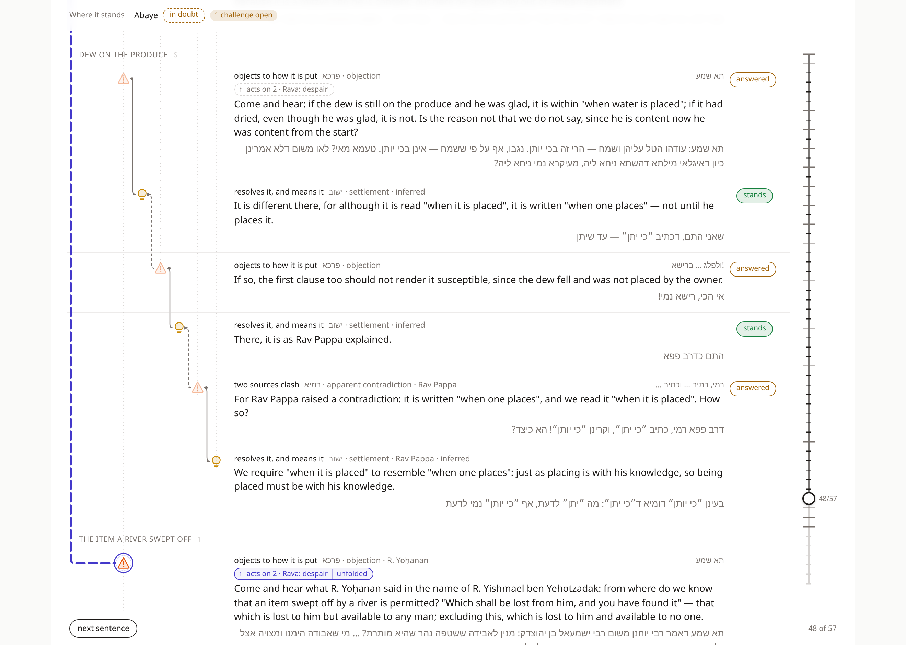
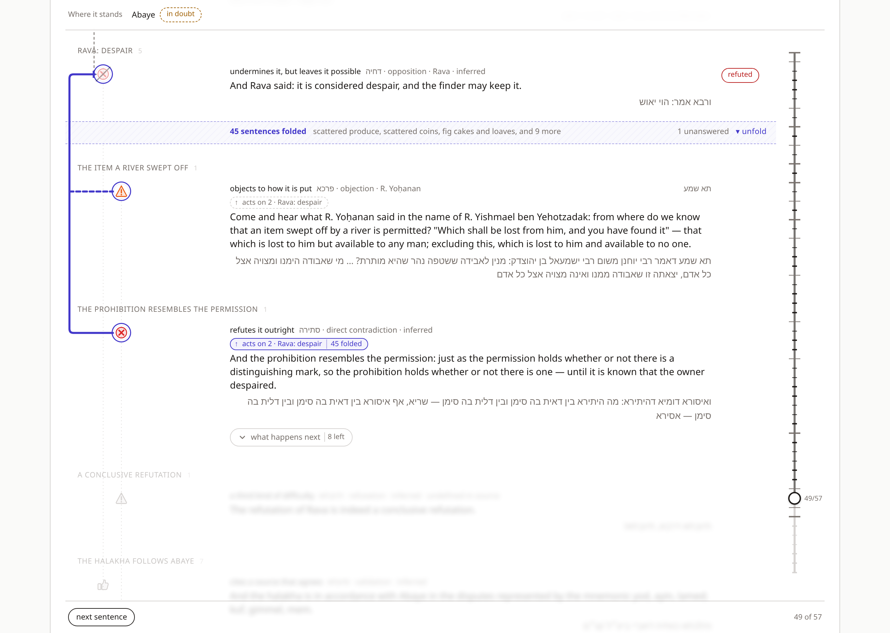
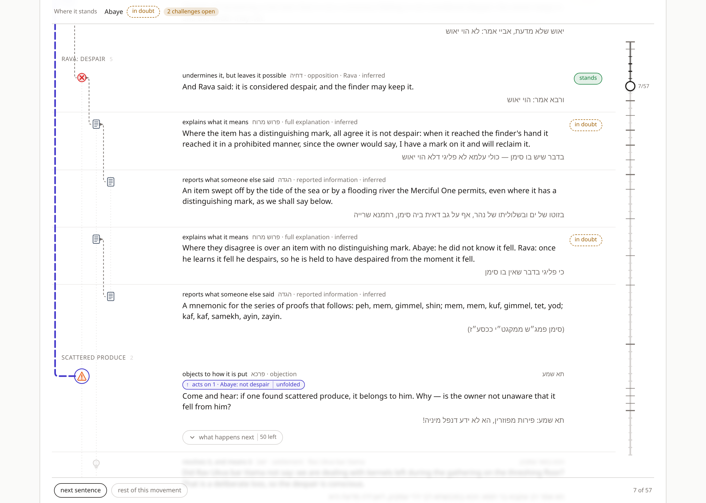
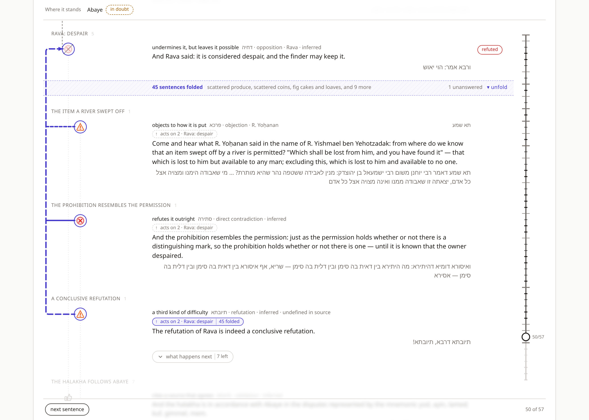
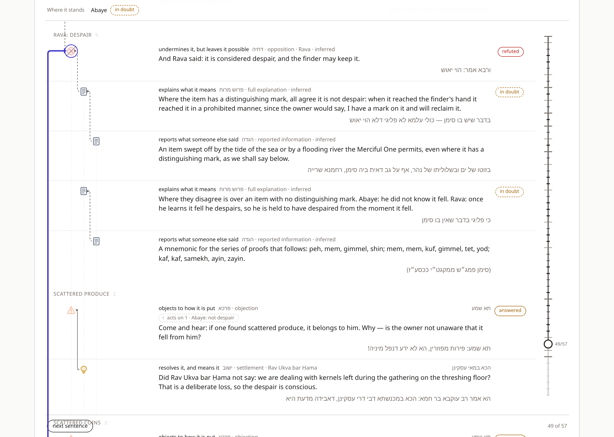

# Sugya Waterfall — v3: The Rail

**How a refutation forty-six sentences from what it refutes is drawn pointing at
it.** The third document in the series. `SUGYA_WATERFALL_VISUALIZATION_V1.md`
gives the taxonomy and the model; `SUGYA_WATERFALL_AT_SCALE_V2.md` records what
broke on Bava Metzia 21b–22b and what was done about it. This one takes up the
thing v2 gave up on — drawing the long relation — and the thing v2 listed as its
largest remaining win — folding settled argument in place — and finds they are
the same feature.

The test case is unchanged: `יאוש שלא מדעת`, fifty-seven moves. The two sentences
that motivated the work are

> **ואיסורא דומיא דהיתירא** — and the prohibition resembles the permission (sentence 49)
> **תיובתא דרבא, תיובתא** — the refutation of Rava is conclusive (sentence 50)

Both act on Rava's `דחיה` at sentence 2.

---

## 0. The short version

v2's answer to a forty-six-sentence connector was to not draw it: the move
printed `↑ acts on 2 · Rava: despair` instead. That was honest and it was a
retreat. A printed reference tells the reader *that* the refutation reaches Rava;
it does not show it landing.

v3 draws the line — and, at the moment that matters, makes the distance short
instead of the line long.

1. **The rail.** A long-reaching move gets a thick bracket in the left margin,
   in a colour nothing else uses, from the target's icon down to its own. It is
   materialised for one move at a time — the *open* move — and every other
   long-reaching move carries a printed handle, as in v2; pressing the handle
   makes that move the open one. A `תא שמע` arrives with its rail drawn the full
   distance, to be traced back up the page to the claim it challenges.
2. **The fold.** Everything between the open move and its target can fold away
   into a single band, so the two sit a few rows apart and the rail between
   them is short. A move that *closes* business on its target — the `סתירה`
   that refutes Rava, the `והלכתא` that rules for Abaye — arrives folded: one
   press of *what happens next* at the last `תא שמע` and forty-five sentences
   put themselves away, and the reader sees the blow land on the claim itself.
3. **Clicking the rail toggles the fold.** Unfolded, the rail runs the full
   distance — six thousand pixels at the climax — and is followed by scrolling
   along it. Folded, the band stands in for what it hides and says what is there.

The fold is presentation only. The frontier does not move; the analysis still
runs over every revealed sentence; every verdict on screen accounts for what is
folded. This is what separates it from v2's fold-back chevron, which *retracts*
the frontier, and it is what makes the band's summary trustworthy.

---

## 1. Why a line, and why not a long one

v2 §3.2 established that thirteen elbows in one gutter overdraw into a stripe,
and that the far end of a four-thousand-pixel line is off-screen regardless. The
first still holds, and the rail answers it: a lane of its own, one line at a
time. The second turns out to have two different answers, and the argument's
structure says which applies.

A **challenge** opens business. When the twelfth `תא שמע` arrives, the forty
sentences between it and Rava are not noise — they are the record of how Rava
has fared, and the reader is meant to feel them accumulate; that accumulation is
what makes the `תיובתא`, when it comes, land as hard as it does. So a challenge
arrives with everything in place and its rail drawn the full distance. The line
is long, but it is a single line in an otherwise empty margin, and following it
up the page is what the reader wants to do with a challenge: *what, exactly,
does this object to?*

A **refutation** closes business. At the moment `ואיסורא דומיא דהיתירא` lands,
the thirteen challenges before it are settled history — answered or not, the
state-of-play strip carries that — and what the reader needs to see is the blow
landing on the claim. So a move that closes business arrives with the history
folded away: **if the target is off-screen, bring it on-screen.** Rava's claim,
a band, the refutation, a short solid rail with a bar at Rava's end.

The distinction is the taxonomy's own. Ch. 9 fixes the effects of the
adjudicating elements — `סתירה` rejects, `הוכחה` raises, `תירוץ` discharges —
and those three are what fold on arrival. A `קושיא` unsettles; it arrives open.

An earlier draft of this document folded on *every* long-reaching move, on the
argument that twelve times the Talmud says *come and hear* and twelve times the
reader should see *the claim — the challenge*. It reads well in the abstract and
badly on the page: at sentence 7 it put Rava's position into a band while the
first challenge landed on Abaye, so the counter-position of the dispute vanished
at the second movement; and by the climax nothing was left to collapse — the
exchange had been folded since sentence 7, and the step that should be the
loudest in the sugya changed nothing on screen. The reader who does want that
rhythm has it one click away: fold any challenge by its rail, and read on.

---

## 2. Rules

All of this is in `src/folding.ts`, with no React in it, and every rule below has
an assertion in `check.ts` against the fixture.

### 2.1 Reach

The *reach* of a move is the number of sentences between it and its target.
A move is **long-reaching** when its reach is at least `LONG_REACH = 4`.

Reach is counted in sentences, not pixels. v2's `LONG_RUN` (260px) decided
whether an elbow could be *drawn*; that is a question about the screen and stays
pixel-based (it still suppresses an elbow between two visible rows that happen to
be far apart). Whether a move should *fold* is a question about the argument's
structure, and the argument does not know how tall the viewport is. Four is
roughly one screen of rows: past it, the target is out of view when the move
appears. On the fixture every `תא שמע` qualifies (the first has reach 5), as do
the three closing blows on Rava and the ruling, and nothing inside a thread does.
Reach decides whether a move *has* a rail; what it does to its target decides
whether it arrives folded (§2.3).

### 2.2 Landing

The three closing moves — `תא שמע` (48), `סתירה` (49), `תיובתא` (50) — all act on
Rava and follow one another. The naive fold for the `תיובתא`, "everything between
it and Rava", would hide the `סתירה` that actually does the refuting, at the
moment it matters most.

So a fold does not run to the move. It runs to the start of the move's
**landing**: the maximal run of consecutive sentences ending at the move that all
act on the same target. For the `תיובתא` that is 48–50, and the fold is 3–47 —
the same band the `סתירה` and the `תא שמע` before it produce. The reader
advancing through the climax sees one band and three rows accumulating under it.

This is a structural rule and it is deliberately not a semantic one. An
alternative — "fold what has been answered, keep what still stands" — produces
better-looking results on some steps and unpredictable ones on others (the beams
thread, `weakened` rather than `discharged`, would stick out of every band from
sentence 30 on). A reader should be able to say in advance what a fold will hide.

### 2.3 Focus

The **focus** is the one long-reaching move whose rail is drawn, together with
whether it is folded. It moves in three ways:

| The frontier… | The focus… |
|---|---|
| lands on a long-reaching move | becomes that move — folded if its landing **closes business**, open otherwise (below) |
| lands on anything else | is unchanged — a thread unfolding beneath a challenge keeps the challenge's rail |
| is folded back to before the focus | is re-derived from the new frontier: the latest long-reaching move at or before it, folded or not by the same rule — as if the reader had arrived by advancing |

And the reader moves it directly: clicking the rail, the band, or the open move's
handle toggles the fold; pressing another long-reaching move's handle makes that
move the focus, folded.

**Closing business.** `closesBusiness(effect)` is true for `reject`, `raise` and
`discharge` — the three effects ch. 9 fixes for the adjudicating elements — and
false for `unsettle` and `open`. A landing *arrives folded* when any move in it
closes business. So:

| Sentence | Landing | Arrives |
|---|---|---|
| 7, `תא שמע` — scattered produce | itself | open; Rava's position and scope stay on the page |
| 48, `תא שמע` — the item a river swept off | itself | open; the rail runs forty-five rows up to Rava |
| 49, `סתירה` — the prohibition resembles the permission | 48–49 | **folded** — the press this feature exists for |
| 50, `תיובתא` | 48–50 | folded — its own effect is the placeholder `unsettle` (v2 §4.1), but the `סתירה` is in its landing |
| 51, `והלכתא` | itself | **folded** under Abaye |

Deciding for the landing rather than the move is what keeps the `תיובתא` from
reopening the debate one step after the `סתירה` closed it.

**The reader's choice carries within a landing.** Unfolding the `סתירה` to look
at the debate must not be undone by the `תיובתא` one step later, so a
long-reaching move that arrives in the same landing as the current focus keeps
the focus's fold state — *unless* the landing's character changes, which is the
`סתירה` arriving after the open `תא שמע` before it: then the rule is applied
afresh, and it folds. Across landings nothing carries: a challenge the reader
folded by hand does not make the next challenge arrive folded. A reader should
be able to say in advance what a step will do.

Two consequences worth stating. Reading on past an unfolded rail does not fold it
back up — a local move never touches the focus. And a challenge's rail, drawn the
full distance, is the one long line on the page; there is never more than one,
so v2's stripe cannot recur.

The ruling is the extreme case. `והלכתא כוותיה דאביי` acts on Abaye across
forty-nine sentences and closes business, so it folds all of them — Rava, every
challenge, the refutation — and shows *Abaye: not despair* → *the halakha follows
Abaye*, with a band between reading `49 sentences folded · Rava: despair,
scattered produce, scattered coins, and 13 more · 4 unanswered`. The four are the
beams challenge and the three blows on Rava, which nobody answered because they
won. It is a defensible frame for a ruling, and everything it hides is one click
away.

### 2.4 What the band says

The band is not stored; it is derived at render time from the same analysis as
the rows: the count of sentences hidden, the first three movements that begin
inside the fold, and how many of the folded movements open with a move that is
still `live` or `weakened`. That last number is the one a reader could be misled
about — a folded run of answered challenges and a folded run of open ones look
identical from outside — and it is exactly what the state-of-play strip would say
for them, so nothing behind the band is quietly resolved. v2 §9.4 raised this as
the risk of folding in place; this is the answer to it.

The wording is *unanswered*, not *open* or *still standing*. An unanswered
`סתירה` is doing its work; an unanswered `פרכא` is still a problem. The band
says which count applies. The strip says to whom.

---

## 3. Drawing

### 3.1 A lane of its own

Local elbows run their vertical leg in the gutter *between* depth columns —
`from.x + indent / 2` — which is why thirteen moves on one target overdrew in
v2. The rail does not use a gutter. `LATTICE_MARGIN` (18px) is added to the left
of depth 0, and the rail's trunk runs at `RAIL_X = 6` inside it. Nothing else
occupies the margin; movement headings, which used to start at the left edge,
now start at the icon column. The trunk can run any distance without crossing an
icon or another line, and its horizontal stubs reach in to the target's icon and
the move's, across however many columns lie between.

### 3.2 Weight and colour

Three pixels, four and a half on hover or focus, round caps. The colour is
`--rail`, an indigo. Not a verdict colour: a long red line up the page would
read as *refuted* the whole way, and the rail is not a verdict, it is a relation.
Not `--focus` either, though that was tempting: focus rings appear next to the
rail constantly and the two should not be confused. The hover highlight on the
target row and the ring around the icons the rail joins use `--rail` too, so
"the rail and the things at its ends" are one colour and everything else is not.

The line is dashed when the move's effect is `unsettle`, as an elbow is — v1's
encoding holds — with a longer dash (`12 6`) so it stays traceable at length. The
cap at the target end is the move's effect, as an elbow's is, in the rail's
colour.

### 3.3 The rake

When the landing has more than one move, the trunk runs from the target to the
open move and each other move in the landing gets a branch off it. **Each branch
carries its own effect.** At the `תיובתא` the trunk is dashed (its effect is the
placeholder `unsettle`, see v2 §4.1), the branch to the `תא שמע` is dashed, and
the branch to the `סתירה` is solid — the one move in the landing that actually
rejects. Drawing the whole rake in the open move's style would attribute the
`תיובתא`'s non-effect to the `סתירה`, which is precisely the confusion v2 §4.1
is about.

### 3.4 Above the rows

The elbow layer sits *below* the rows and takes no pointer events. The rail layer
sits *above* them (`z-index: 2`), so it visibly crosses the band — the bracket is
seen to jump the fold — and so it can be clicked. The SVG takes no pointer events;
its strokes do (`pointer-events: stroke`), and an invisible 18px stroke over the
same geometry is the thing actually hit. It is a `role="button"` with a label
that says what it will do, `aria-pressed` for the fold state, and Enter/Space.

### 3.5 The handle

v2's tether badge — `↑ acts on 2 · Rava: despair` — is now the **handle**, and
appears on every revealed long-reaching move (and on any move whose target is
folded out of view, whatever its reach). On the open move it is solid, in the
rail's colour, and reports the fold: `45 folded` or `unfolded`. On the others it
is dashed and grey as before. Pressing it opens the rail or toggles the fold;
hovering it highlights the target. It is the keyboard route to everything the
rail does.

---

## 4. Scrolling

Three different things can happen to the page and each wants a different scroll.
Rather than have each control decide, `planScroll` looks at how the state moved:

| State change | Scroll |
|---|---|
| focus became folded (a refutation arrived, or the fold was toggled on) | the **target** row to the top — the bracket now fits on a screen, so show the whole of it, claim first |
| focus became unfolded by hand | the **open move** to the centre — forty rows just appeared above it; hold the reader at the foot of the rail so they can follow it up |
| a challenge arrived, open | the frontier, `nearest` — that is reading on, and gets the same scroll as any other sentence |
| only the frontier moved | the frontier, `nearest` — v2's rule, unchanged |

Rows have `scroll-margin-top: 88px` so "the top" clears the sticky strip and the
row's movement heading. Before that was added, Rava's row scrolled neatly under
the strip with only its Hebrew showing.

v2's guarantee that rows above the frontier never move is weakened again, to:
**rows above the frontier move only when a fold opens or closes.** Both are
things the reader did, or the arrival of a long-reaching move, and in every case
the scroll plan is what makes the jump legible.

---

## 5. Measured

Viewport 1320×940, the press from 48 to 49:

| | 48, the last `תא שמע` | 49, the `סתירה` |
|---|---|---|
| rows in the document | 51 | 7 (Abaye, Rava, two in the landing, three previewed) |
| rail | 5,683px, dashed | 384px, solid, bar at Rava |
| band | — | `45 sentences folded · … · 1 unanswered` |
| Rava on the page | yes, forty-five rows up | yes, at the top |

Unfolded again by the rail at 50, the rail is 6,103px; at the ruling, 6,400px.
A long rail is followed by scrolling; a three-pixel indigo line in an otherwise
empty margin does not get lost.

Driven headless through all fifty-seven sentences: the focus changes exactly at
the sixteen long-reaching moves — twelve `תא שמע`, the second half of the
seventh's baraita, the `סתירה`, the `תיובתא`, the ruling — and nowhere else. Of
those, exactly three arrive folded: 49, 50 and 51. At 7 Rava's row is in the
document; at 48 nothing is folded; at 49 forty-five sentences are; unfolding at
50 by the rail survives; 51 folds forty-nine under Abaye; folding back from 51
to 50 finds the landing folded and from 50 to 48 finds the challenge open. The
band's text at each step matches `summarizeFold`; toggling by rail, band, handle
and keyboard all agree. The four short fixtures have no long-reaching move and
render exactly as before.

---

## 6. Changes to the v2 rules

- **v2 §3.2** — long runs are not drawn. *Now:* one is, the open move's, in its
  own lane. The rest print a handle, as before.
- **v2 §3.5** — rows above the frontier never move. *Now:* they move only when
  a fold opens or closes.
- **v2 §6** — folding retracts the frontier. *Now:* that is *folding back*, and
  it still does. *Folding* is a new, distinct thing that leaves the frontier and
  the analysis alone.
- **v2 §9.4** — folding in place risks a summary whose verdict depends on
  hidden sentences. *Answered:* the band's count is derived from the same
  analysis as everything visible and states unanswered challenges explicitly.

---

## 7. Open

1. **The static export does not draw rails.** There is no "open move" in a
   still image. The right static figure is probably the rake of *every*
   long-reaching move on a target — thirteen branches on one trunk down the
   margin — which is an overview, not a reading, and would be a new kind of
   figure rather than the existing one with more lines.
2. **One rail at a time is a real limit.** A reader might want Abaye's rake
   pinned while opening one of Rava's. The margin is one lane; a second would
   need `LATTICE_MARGIN` to grow and a rule for which rail gets which lane.
3. **Folds do not nest.** The focus model is flat on purpose — one fold, one
   band, no question about what "unfold" reveals. A tree of folds (unfold the
   climax band to find the ten answered challenges still folded inside) is the
   natural next shape and would need a different state model.
4. **`LONG_REACH = 4` is a guess** at how many rows a viewport holds. It could
   be measured. It should probably not be: a fold that happened on one screen
   size and not another would be hard to explain.
5. **The band names movements, not sentences.** When the fold starts mid-
   movement — Rava's scope sentences, hidden under Rava's own row — they are
   counted but not named. The band could name a partial movement as such.
6. Everything in v2 §9 that is not §9.4 is still open, and §9.1 (let a ruling
   of `tradition` provenance discharge what stands against its target) is now
   visible on screen: the ruling's band says `4 unanswered` about challenges
   the Talmud considers closed.
7. **`discharge` folds on arrival untested.** It is in `closesBusiness` because
   an answer closes what it answers, but no answer in the fixture reaches more
   than one sentence; a sugya where a `שאלה` is answered forty sentences later
   would be the first to exercise it, and might argue for folding only the
   thread the question opened rather than everything since.
8. **The `תיובתא` folds by inheritance, not by its own effect.** Its placeholder
   `unsettle` (v2 §4.1) does not close business; it arrives folded only because
   the `סתירה` is in its landing. A `תיובתא` that stood alone — the Talmud does
   sometimes say it without spelling out the contradiction first — would arrive
   open, which is wrong, and is one more place the undefined leaf shows.

## Appendix — files touched

| File | Change |
|---|---|
| `src/folding.ts` | new — `reachOf`, `landingStart`, `foldRangeOf`, `closesBusiness`, `arrivesFolded`, `focusAfterSeek`, `slotsOf`, `summarizeFold` |
| `src/layout.ts` | `LATTICE_MARGIN`, `RAIL_X`, `RAIL_WIDTH`, `railPath`, `railBranch`; `latticeWidth` includes the margin |
| `src/check.ts` | 51 assertions on reach, landing, fold range, what arrives folded, focus transitions in both directions, slots, and the band's derived summary |
| `app/components/RailLayer.tsx` | new — the materialised rail, rake, hit path, keyboard |
| `app/components/FoldBand.tsx` | new — the band |
| `app/useSugyaController.ts` | focus state, slots, handles, `planScroll`; elbows exclude anything with a handle. (Extracted from `SugyaView.tsx`, which is now a thin arrangement of this hook.) |
| `app/components/UnitRow.tsx` | tether → handle with open/folded state; icon offset by the margin; `data-id` |
| `app/styles.css` | `--rail`; `.rails`, `.rail-*`; `.row-handle*`; `.fold*`; `.row-on-rail`; headings clear the margin; `scroll-margin-top` on rows |
