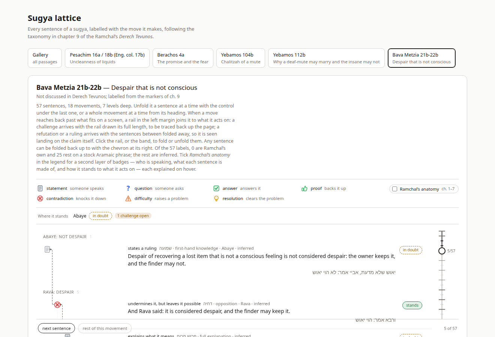
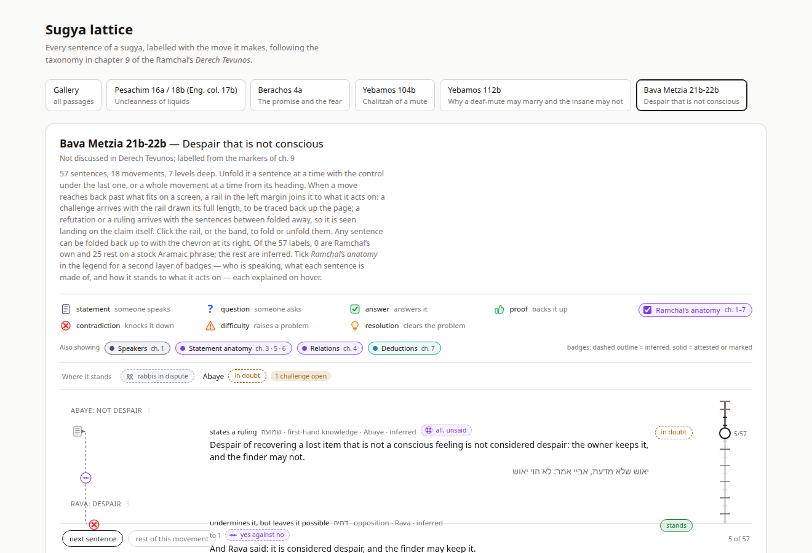
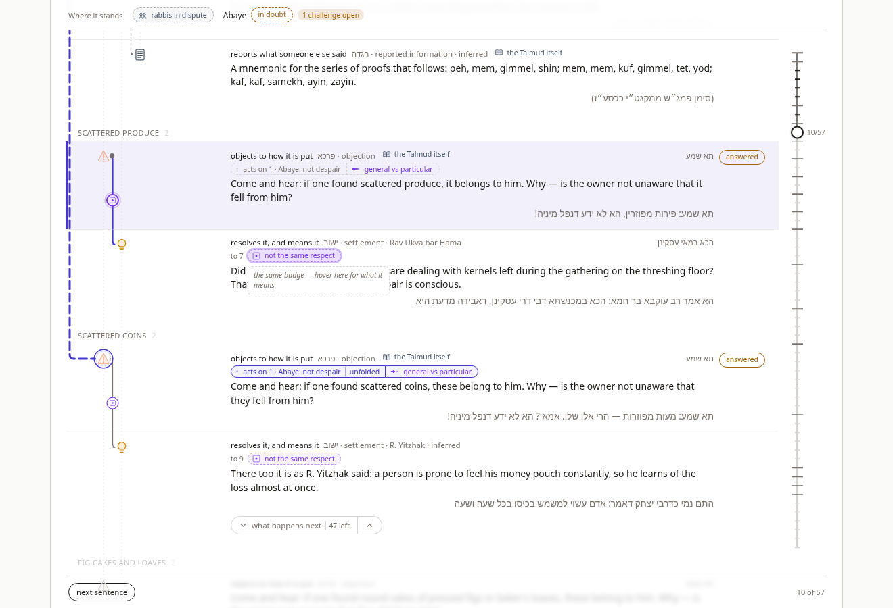
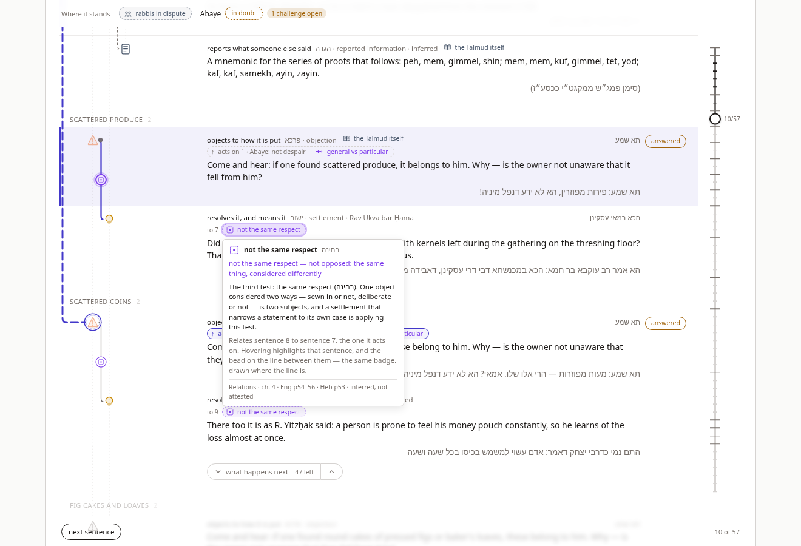
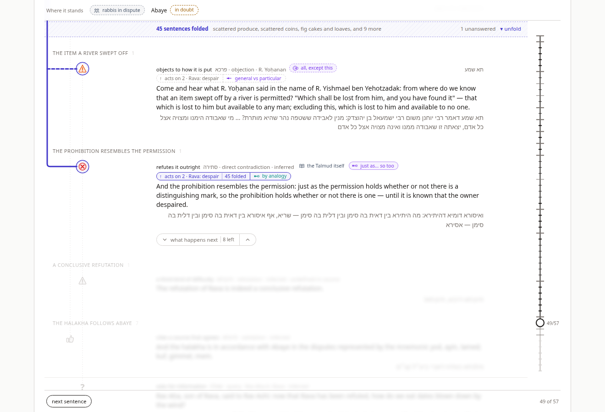

# Sugya Waterfall — v4: The Anatomy

**How a second vocabulary is laid over the lattice without touching it.** The
fourth document in the series. `SUGYA_WATERFALL_VISUALIZATION_V1.md` gives the
chapter 9 taxonomy and the model; `SUGYA_WATERFALL_AT_SCALE_V2.md` records what
broke at fifty-seven sentences; `SUGYA_WATERFALL_V3_RAIL.md` draws the long
relation and folds settled argument away. All three are about one question —
what does this sentence *do* to an earlier one? This document adds the other
question the book spends its first seven chapters on: what *is* this sentence,
who says it, how does it stand to the one it answers, and by what rule is it
drawn?

The icon set for that vocabulary is in `icons/CH1-3_ICONS_EXPLORATION.md`,
`icons/CONTACT_SHEET_PART2.md` and `icons/icons-ch4-7/` — fifty-three glyphs
over chapters 1–7. The brief was to put them *somewhere else* than the rails:
additional context, not a replacement, and not a source of confusion.

The test case is unchanged: `יאוש שלא מדעת`, fifty-seven moves. The two sentences
that motivated the work are the ones the ch. 9 layer already draws well and
still says the least about:

> **תא שמע: פירות מפוזרין** — come and hear: scattered produce (sentence 7)
> **ואיסורא דומיא דהיתירא** — and the prohibition resembles the permission (sentence 49)

The first is an *objection*, the icon says, and it acts on Abaye. What it does
not say is that the objection's whole force is a **general claim set against a
particular one** — the mishnah rules for all lost produce, Abaye for a case of
it — and that the settlement one row later dissolves it by the third of
Ramchal's four tests, **not the same respect**. The second is a *direct
contradiction* of Rava; what the icon does not say is that it is a refutation
**by analogy**, and that the Talmud marks it as one with its own stock phrase,
`מה … אף`.

---

## 0. The short version

Chapter 9 names moves; chapters 1–7 name statements and the relations between
them. They are different levels of description, and v4 keeps them on different
layers. Nothing in the rails, icons, verdicts, folds or connectors changes. On
top of them sits **Ramchal's anatomy**, a layer switched on from the legend and
off by default.

When it is on:

1. **A row carries what it is.** After the ch. 9 label, marker and speaker, the
   meta line gains small violet chips for the shape of the statement — *all,
   except this*; *just as… so too*; *if… then* — and, in teal, for the deduction
   the sentence performs. Each is one glyph and two or three everyday words.
2. **A move carries how it relates.** A relation is about two sentences, so its
   badge sits with the reference to the second: **inside the handle** of a
   long-reaching move (`↑ acts on 2 · Rava: despair | 45 folded | ⟿ by analogy`)
   and, for a move with an elbow, on a short `to 7` line under the meta.
3. **Where the elbow is long enough, the same relation is a bead on it.** The
   bead is best-effort — it appears only when the run has room, and never on a
   rail. Pointing at the chip lights the bead and the elbow. Pointing at the
   bead lights the chip and puts one line on it — *the same badge — hover here
   for what it means* — and no more: the words are on the row, so that is where
   the explaining is done.
4. **Every badge explains itself, and the tooltip is the whole explanation.**
   Hover or focus gives the name, its Hebrew, a one-line gloss, the definition,
   the passage-specific note, what sentence it describes or relates, and where
   in the book it comes from. A badge does nothing else: there is no second,
   longer form of the same text to open.
5. **Who is speaking** is a slate badge: on the strip for the whole passage
   (*rabbis in dispute*; *one man, both sides*; *the Talmud itself*), and on any
   row with no named speaker, quietly, as the Talmud's own voice.
6. **Lenses.** A second legend row turns each family on and off separately —
   speakers, statement anatomy, relations, deductions — for a reader who wants
   only one of them.

When it is off the sheet is v3, plus one unticked box in the legend.

---

## 1. Two vocabularies, two levels

v1 §1 argued that chapter 9 is the right layer to *draw* because it is the one
where Ramchal says what a sentence does to another, and the doing is what has
shape. That argument stands, and it is why the new icons could not go into the
rails: an icon in the rail answers "what happened here?", and *categorical* or
*a fortiori* is not an answer to that question. A reader who saw the objection
icon replaced by a four-dot *all of them* glyph would have lost the thing the
lattice exists to show.

But the first seven chapters are not decoration either. Ramchal's own order
(ch. 2, Eng p18–20) is: know who is talking, understand a statement, understand
how two statements stand, understand what one implies, know when it is not
literal, and know how one is derived from another — and *then* the parts of a
sugya. The ch. 9 move is the conclusion of that analysis; chapters 1–7 are its
working. So the layer is placed as working is placed: close to the thing it
explains, in a smaller type, and removable.

The vocabulary is split into four **families**, each with one hue, so that in a
mixed view the eye reads moves by the element colours (which stay exactly as
they are) and this layer by shape:

| Family | Chapters | Hue | Level | Count |
|---|---|---|---|---|
| Speakers | 1 | slate | the passage; a nameless row | 3 |
| Statement anatomy | 3 · 5 · 6 | violet | the row | 27 |
| Relations | 4 | violet | the move (row → target) | 13 |
| Deductions | 7 | teal | the move | 10 |

Green and red remain verdicts and nothing in this layer uses them.

**Level** is the one structural fact the layer has to respect. A badge about
one sentence — *particular*, *exclusive*, *not meant literally* — belongs on
that sentence's row. A badge about two — *general against particular*,
*converse*, *by analogy* — belongs on the *move* from one to the other, and a
move in this model is a unit with a `target`. The model enforces it: an
edge-level annotation on a unit with no target is rejected by `analyze`, as a
misplaced ch. 9 label would be. The three families that are not relations or
deductions are row-level; those two are edge-level; there are no exceptions.

Every type is defined by an everyday phrase rather than a term of logic. This
follows the book's own habit. Ramchal fixes nearly every type by a stock word —
*all*, *except*, *provided that*, *if… then*, *just as… so too* — and the chip
carries that word's picture, so a reader who has never opened chapter 3 reads
`all, except this` correctly the first time, and reads `exception` correctly the
second, from the tooltip.

---

## 2. Rules

### 2.1 Where a badge sits

| The badge is… | It sits… | As… |
|---|---|---|
| the passage's party (ch. 1) | on the *where it stands* strip, first | a slate chip |
| the Talmud's own voice (ch. 1) | in the meta line of any row with no named speaker | slate text, no box — it recurs on 38 of 57 rows and must not shout |
| a statement type (chs. 3–6) | in the meta line, after the ch. 9 label, marker, speaker and basis | a violet chip |
| a relation or deduction, on a move with a **handle** | inside the handle, as its last segment | inline, no box of its own |
| a relation or deduction, on a move with an **elbow** | on a `to N` line under the meta | a chip |
| the same, when the elbow has room | on the elbow, midway down the run | a bead |

A row that is not yet revealed shows no badges: what a sentence is stays behind
the same blur as what it says. A folded row is not on the page at all. The
strip's party badge is on the page from the first sentence, since who is arguing
is known before anything is argued.

### 2.2 The bead

A relation is about two sentences and the connector already joins them, so the
natural place for the relation is on the connector. The connector is also a
34px gutter shared with the depth columns, and v2 §3.2 established what happens
when that gutter is asked to carry more than it can. So the bead is a
best-effort rule, not a promise:

- A bead is drawn only where an **elbow** is drawn. A long-reaching move has no
  elbow — it has a rail, or a handle — and its badge rides in the handle
  instead. The open move's rail carries nothing; the handle is right beside it.
- The run must be at least **44px** tall (`BEAD_MIN_RUN`). The shortest pair of
  adjacent rows is still some 60px apart, so nearly every adjacent elbow
  qualifies; the rule exists for the tight cases — a deep passage at the indent
  floor, a one-line row under another — where a bead would sit on an icon.
- Its radius is `min(8.5, indent / 2 − 1)`: 8.5px at the full 34px indent, 8px at
  the 18px floor v2 introduced for deep passages, always clear of the icon
  column on both sides.
- It sits at `x = target.x + indent / 2`, the gutter's centre, and at the run's
  midpoint.
- It carries the **first** edge badge of the move. A move with two — a relation
  and a deduction — shows the first in the bead and both in the chip.
- The four glyphs that do not read at 11px (the two syllogisms on the denial,
  *not similar*, *not greater*) are drawn as a filled dot in the bead and as
  themselves in the chip.

Pointing at the bead does three things: the bead gains a ring, the elbow
thickens, and the chip on the move's row lights. Pointing at the chip does the
same in reverse. In both directions the target row is peeked, exactly as the
rail's hover peeks its target in v3.

The bead itself explains nothing. It is 17px of glyph in a gutter, and a popup
opening beside it covered the very chip it was pointing at. What appears instead
is one dashed line on that chip — *the same badge — hover here for what it
means* — which both names the pairing and says where to go for it; the reader
who wants the explanation moves a few pixels right and gets it in full. The
chip's own tooltip, when a bead is drawn, closes the loop from the other side:
*…and the bead on the line between them — the same badge, drawn where the line
is*. Between them, nothing lets a reader count two things where there is one.

Beads can be turned off wholesale — `useSugyaController(sugya, { beads: false })`
per page, or `BEADS_ON_ELBOWS = false` for the build — and nothing else moves.
The chips do not depend on them.

### 2.3 Basis

Every ch. 9 label carries a basis — *attested* where Ramchal himself labels the
passage, *marked* where the Talmud's stock word does, *inferred* otherwise — and
every badge in this layer carries the same three. It draws the same way: an
inferred badge has a dashed outline, an attested or marked one a solid outline,
and the tooltip's footer says which in words.

None of the five fixtures' sentences is one Ramchal labels in chapters 1–7, so
no badge on them is attested. Eight are marked. In Bava Metzia, six: the two
analogisms and their comparatives, because the text says `מה … אף`; and two
discrepancies, because the mishnah says `אף על פי ש` and the Gemara `אף על גב ד`,
which is Ramchal's stock word exactly. In Pesachim and Berachos, a categorical
each, marked by `כל עקר` and `בכל`. Bava Metzia's other thirty-nine are inferred
and drawn dashed. The badge's basis is independent of the row's: an objection
can be an *inferred* move (ch. 9) carrying a *marked* form (ch. 3).

### 2.4 The switch and the lenses

The layer is **off by default**. A first reader gets the v3 sheet; the box in the
legend is the invitation, and the header hint names it. The choice is kept in
`localStorage` under `sugya-lattice.anatomy`, with the lens settings, so a reader
who turns it on has it on for every passage until they turn it off.

When on, a second legend row — *Also showing* — holds one pill per family, each
with the family's chapter, each a toggle, each with a tooltip saying in a
sentence what that family is about. A lens off removes that family's badges
everywhere: from rows, handles, beads and the strip. Turning
every lens off is not the same as turning the switch off; the lens row stays,
so the reader can see what they have hidden.

### 2.5 What a badge says

The brief's first amendment was that the pills *really* need explanatory
tooltips. Every badge, lens pill, the switch, the legend's element entries, the
row icon and the handle now have one, and none of them is a browser `title`. The
tooltip is the whole of what the layer says about a badge, so it is structured:

| Line | Says | Example (the chip on sentence 8) |
|---|---|---|
| name | the type, its Hebrew | **not the same respect** · בחינה |
| gloss | the everyday reading, in the hue | *not the same respect — not opposed: the same thing, considered differently* |
| definition | Ramchal's rule in a sentence or two, including the ch. 6 count of intentions where a type has one | *The third test: the same respect (בחינה). One object considered two ways…* |
| note | this passage, if the fixture says something | *`הכא במאי עסקינן`: kernels on the threshing floor are…* |
| context | which sentence it describes or relates, and what hovering does | *Relates sentence 8 to sentence 7, the one it acts on. Hovering highlights that sentence, and the bead on the line between them — the same badge, drawn where the line is.* |
| origin | family · chapter · pages · basis | Relations · ch. 4 · Eng p54–56 · Heb p53 · inferred, not attested |

The context line is written per place. On a row chip it says *describes
sentence 5*; in a handle, *relates 49 to 2, the one it acts on*; on the strip,
that it is the whole passage. A bead has no tooltip of its own — §2.2 — and the
one line it does put on its chip is the only text in the layer that is not an
explanation but a direction to one.

A badge does nothing but explain itself. An earlier build also pinned a card
under the row on click — the same lines set larger, with a *close* button — and
having both was simply the text twice, the tooltip standing over the card that
repeated it. The tooltip won, since it is the one that appears where the eye
already is. Nothing was lost with the card: the one field it printed and the
tooltip did not was the ch. 6 count of intentions, and every definition that
has a count already says it in words — *two intentions, the rule and the
exception*. So a badge is not a button. It takes the tab order, because focus
opens the tooltip for a reader who is not using a pointer, and that is all it
does; nothing in this layer changes the frontier, the fold or the focus.

### 2.6 The handle

v3 §3.5 gave a long-reaching move a printed handle: `↑ acts on 2 · Rava: despair`
plus, when folded, `45 folded`. The handle is a reference to the second
sentence, which is exactly where the relation belongs, so it gains one more
segment: the relation, with its glyph, in the hue. On the `סתירה` the handle
reads `↑ acts on 2 · Rava: despair | 45 folded | ⟿ by analogy`. Pointing at the
segment lights the rail as pointing at the rail does, and its tooltip names the
two sentences and says the type's stock word is in the text.

---

## 3. Drawing

**Hues.** Three, one per family, chosen away from every colour the sheet already
uses: violet (`#7c3aed`) for the shape of a statement and for relations — both
are chapter 3–6 material and are told apart by level, not colour; teal
(`#0d9488`) for chapter 7; slate (`#475569`) for chapter 1. The glyphs are
inlined as SVG bodies coloured by `currentColor`, so a badge is one colour in
one place and the hue can change without touching fifty-three files.

**Weight.** A chip is 10.5px text beside a 14px glyph in a fully round 1px
outline, 18.7px tall against the meta line's 11.5px type — the same recipe as
the ch. 9 label's `inferred` tag, so the line stays one line of one weight with
a little more in it. That is the size of a chip *wherever* it appears: in the
meta line, on the `to N` line, and inside the handle. On the strip, where the
chip stands among verdict pills rather than in a row, it takes their vertical
padding instead, so the strip reads as one set of pills. The speaker badge is a
chip without outline or background; it recurs on two rows in three and is the
quietest thing on the row until hovered. The handle segment inherits the
handle's type and adds only the glyph and the hue — and the handle's two halves
stretch to a single height, so a badged handle has one silhouette rather than a
step at the seam.

**The tooltip** is 300px wide (320px for the legend's entries and the switch),
opens on hover or focus, and measures itself before it shows: it hangs to the right of
its anchor unless that would leave the sheet, and below unless there is more
room above. A row with an open tooltip is raised over its siblings and the
sticky header, so a tooltip near the top of the sheet is never cut by the strip.
The hint a bead puts on its chip is the same popup on the same anchor, 210px
wide, dashed and italic in the muted colour: it is a signpost, and it is not to
be mistaken for the paragraph it points at.

**States.** A badge has one state: hot, meaning its bead or chip is under the
pointer — with the pointer's own side of that pair distinguished only by which
popup opens, the full one on the chip and the hint when it is the bead being
pointed at. Hot fills its outline colour at 16% and gains a soft halo — except
a handle segment, which is underlined dotted instead, since a fill inside the
handle would read as a second button. The hot elbow goes from 1.25px to 2.25px
and takes the rail's colour, as the rail does on hover.

**Off** removes the lens row, every badge, every bead and every `to N` line.
Rows that had a `to N` line lose a line, so the page does shift when the switch
is thrown; it is thrown rarely and deliberately, and the alternative — reserving
the line always — would tax the v3 sheet for a feature it has turned off.

---

## 4. Measured

Bava Metzia 21b–22b, layer on, every lens on:

| | value |
|---|---|
| sentences | 57 |
| sentences with a badge | 39 |
| badges in the fixture | 45 — 9 on rows, 36 on moves |
| of which marked / inferred / attested | 6 / 39 / 0 |
| badges across all five fixtures: marked / inferred / attested | 8 / 51 / 0 |
| rows with no named speaker (the Talmud's own voice) | 38 |
| at sentence 10: badges on the page / beads / elbows | 13 / 3 / 6 |
| at sentence 48, the last `תא שמע`: badges / beads / elbows / handle segments | 77 / 22 / 32 / 13 |
| at sentence 49, the `סתירה`, folded: badges / beads / handle segments | 7 / 1 / 2 |
| switch off → first paint | 88ms |

The forty-five labels are thirteen `contradictory` (every `תא שמע` reads a
general claim against a particular one), fourteen `differs-in-context` (every
`הכא במאי עסקינן` dissolves it by respect), three syllogisms on the denial (the
`אי הכי` presses), two analogisms, two comparatives, two discrepancies, two
diametrically opposed, and one each of seven others. That distribution is itself
a reading of the passage: twelve objections of one form, met twelve times by
one test, until an analogy — the one move whose form the Talmud names aloud —
ends it.

The other fixtures carry four, five, four and one labels; between them the five
exercise nineteen of the fifty-three types. The rest of the vocabulary is
defined, glyphed, tested for coverage and waiting for passages.

---

## 5. Changes to the v3 rules

Nothing in `folding.ts`, `sugya.ts`'s reducer, `verdict.ts` or `layout.ts`'s
rail and elbow geometry changes. Concretely:

- `Unit` gains an optional `anatomy: Annotation[]`; `Sugya` gains an optional
  `party`. A fixture without either renders exactly as before, and the legend
  then has no switch.
- `analyze` rejects an edge-level annotation on a unit without a target.
- The handle gains an optional last segment. Its hover and click are unchanged.
- The connector gains a *hot* state, driven by the same `hotEdge` the chip and
  bead share.
- The strip gains the party, before the claims.
- Every `title` attribute on the sheet — legend entries, the row icon, the
  handle — is replaced by the same tooltip the badges use, so there is one
  hover vocabulary on the page.
- The header hint mentions the switch.

The fold rules are untouched, and a badge is never a reason to fold or unfold.

---

## 6. Open

- **Attested labels.** The fixtures are ch. 9 passages; none is one Ramchal
  labels in chapters 1–7. A fixture built from his own examples — Berachos 20b
  for *categorical*, Yebamos 84a for *particular*, Pesachim 19a for the
  syllogism on the denial, Pesachim 5b for elimination — would exercise the
  `attested` basis and let the layer be checked against the book as the ch. 9
  layer is.
- **One bead per elbow.** A move with a relation and a deduction shows one in
  the bead and both in the chip. Two beads on one run were tried in the
  exploration and read as two moves.
- **The bead on the rail.** The open move's rail carries no bead by rule; the
  handle beside it does the work. A short rail — the first challenge, four rows
  up to Abaye — has room, and a reader who has learned to look at the line for
  the relation will look there. Not done, because the rail's hover already means
  *toggle the fold* and a bead's means *look at the chip*; two meanings on one
  line is the confusion the brief ruled out.
- **Nothing to read at length.** With the card gone (§2.5) the layer says what
  it has to say in a 300px tooltip, and a reader who wants the chapter itself
  has only the page citation to go on. A route from a badge to the cited
  passage would close that gap without putting a second copy of
  the tooltip on the sheet.
- **Layout shift on toggle.** See §3. Reserving the `to N` line would remove it.
- **Static export.** `renderSugya` draws the ch. 9 lattice and ignores the
  layer; a badge in a pasted SVG has no tooltip to explain it. If the export is
  wanted with badges, the tooltip's text would have to go into a caption.

---

## Appendix — files touched

| File | Change |
|---|---|
| `src/anatomy.ts` | new — fifty-three types in four families with level, hue, chapter, Hebrew, stock word, everyday name, gloss, definition and pages; `Annotation`, `Badge`, `Party`; `badgesOf`, `speakerBadge`, `basisOf`, `hueOf`, `annotationErrors` |
| `src/glyphs.ts` | new — the fifty-three SVG bodies, hex colours replaced by `currentColor`; `BUSY_GLYPHS` for the four that fall back to a dot in the bead |
| `src/sugya.ts` | `anatomy` on `Unit`, `party` on `Sugya`; `analyze` rejects a misplaced edge label |
| `src/layout.ts` | `BEAD_MIN_RUN`, `beadRadius`, `beadFits`, `beadPoint` |
| `src/theme.ts` | `hue` on the palette |
| `src/fixtures/*` | forty-five annotations on Bava Metzia, four on Pesachim, five on Berachos, four and one on the two Yebamos passages; `party` on all five |
| `src/check.ts` | 43 assertions on the vocabulary, glyph coverage, hues, levels, placement validation, the fixtures' labels and their bases, and the bead's geometry |
| `app/hooks/useAnatomyLayer.ts` | new — the switch and four lenses, persisted |
| `app/useSugyaController.ts` | `anatomy`, `badgesAt`, `party`, `beads`, `hotEdge` and `hotBead` + `hoverEdge`, `hasBead`, `targetOrdinal`; `ControllerOptions.beads`, `BEADS_ON_ELBOWS` |
| `app/components/Tooltip.tsx` | new — the hover/focus tooltip that measures its own placement, and the unprompted one-line `hint` form |
| `app/components/Glyph.tsx`, `AnatomyBadge.tsx`, `BadgeTip.tsx` | new — one glyph; one badge in four variants (chip, bare, inline, quiet) with a hot state and a hinted one; what its tooltip says, per place |
| `app/components/BeadLayer.tsx` | new — beads on measured elbows, and their hover, which lights the chip rather than explaining itself |
| `app/components/LegendBar.tsx` | the switch, the lens row, tooltips on the element entries |
| `app/components/UnitRow.tsx` | row chips, the speaker badge, the `to N` line, the handle segment; tooltips replace `title` on the icon and the handle |
| `app/components/ConnectorLayer.tsx` | `hotEdge` |
| `app/components/StateOfPlay.tsx` | `party` |
| `app/SugyaView.tsx`, `app/SugyaHeader.tsx` | wiring; the hint |
| `app/styles.css` | `--violet`, `--teal`, `--slate`; `.tip*`; `.badge*`; `.legend-switch`, `.lenses*`; `.bead*`; `.connector-hot`; `.row-handle-badges` |
| `src/index.ts` | exports for all of the above |
| `icons/icons-ch4-7/` | the zip's SVGs, unpacked beside the two exploration documents that describe them |
