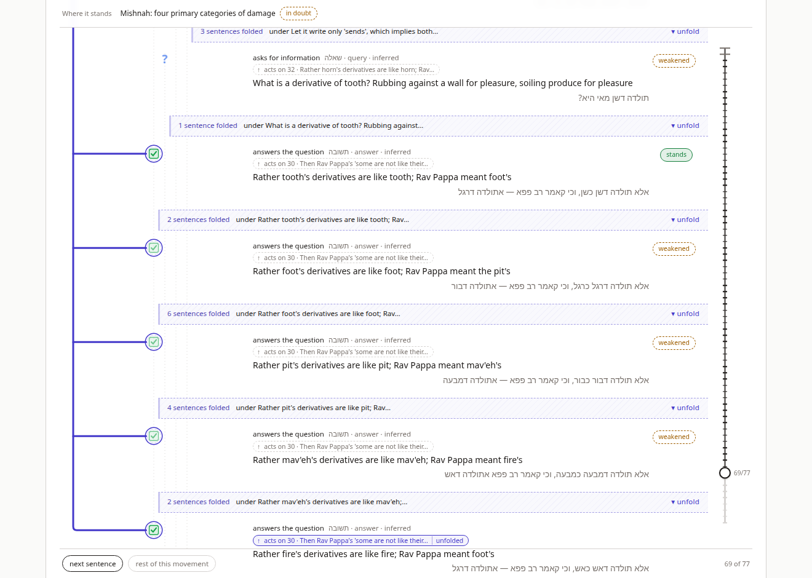
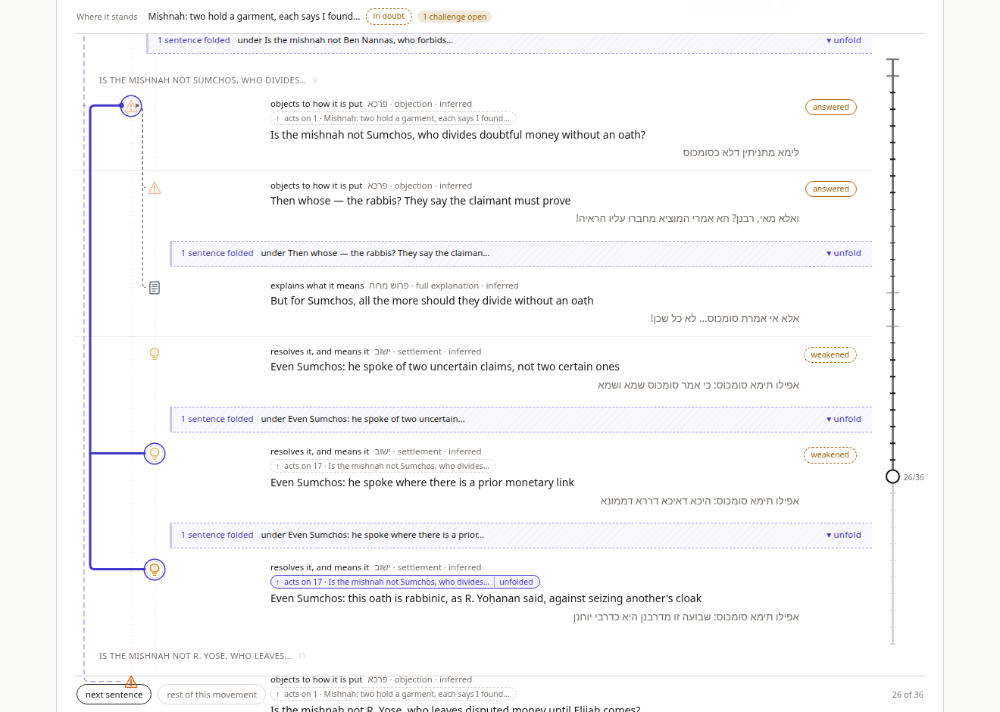
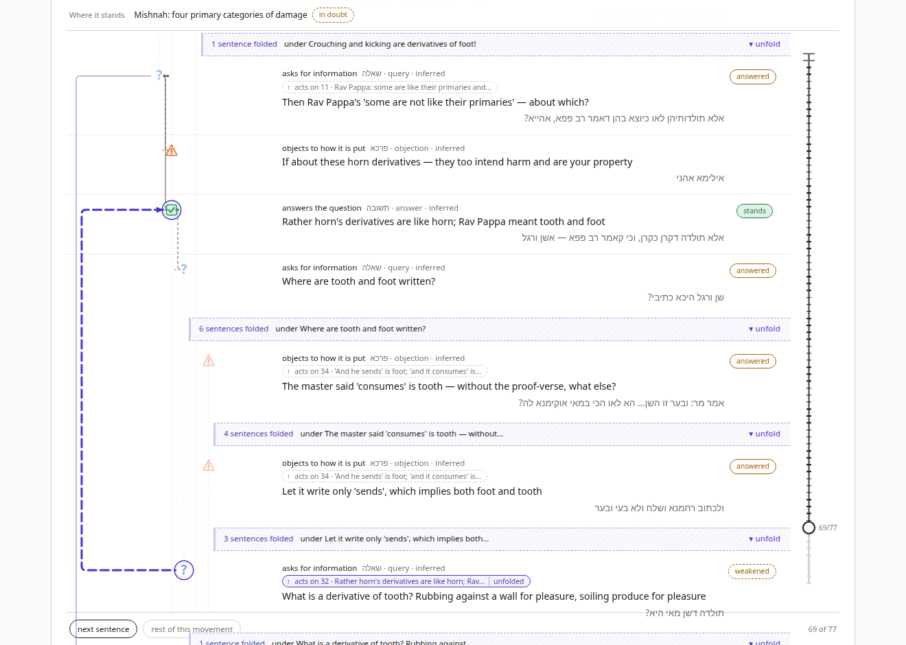
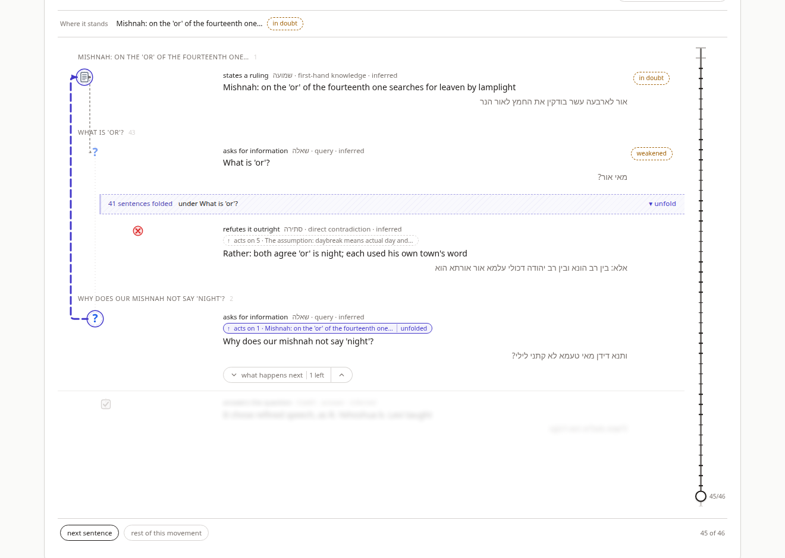

# Sugya Waterfall — v5: The Fold Tree

**How a fold remembers the folds inside it, and how a rail is drawn inside a
rail.** The fifth document in the series. `SUGYA_WATERFALL_VISUALIZATION_V1.md`
gives the chapter 9 taxonomy and the model; `SUGYA_WATERFALL_AT_SCALE_V2.md`
records what broke at fifty-seven sentences; `SUGYA_WATERFALL_V3_RAIL.md` draws
the long relation as a rail and folds settled argument away behind one band;
`SUGYA_WATERFALL_V4_ANATOMY.md` lays the chapter 1–7 vocabulary over all of it
without touching the rules. This document changes the rules v3 set — and only
those — because a study of six more sugyot (`nested_rail_research/VERDICT.md`)
found that v3's one fold, one band and one rail were the wrong shape for what
the Talmud does with a sub-argument.

The test case is unchanged — `יאוש שלא מדעת`, fifty-seven moves — and four
research passages join it: the opening sugyot of Bava Metzia, Bava Kamma,
Pesachim and Gittin, annotated with `id / move / target / text` and nothing
else. The two sentences that motivated the work are from those:

> **אלא תולדה דאש כאש** — rather, fire's derivatives are like fire (Bava Kamma 3a, the fifth `אלא` on `אהייא`)
> **לימא מתניתין דלא כסומכוס** — is the mishnah not against Sumchos? (Bava Metzia 2a, a challenge with a seven-sentence answer folded under it)

The first is a closer that lands, in v3, on a band of thirty-eight rows that
unfolds to thirty-eight flat rows — where the structure is six candidates each
killed by a `מאי שנא`. The second is a sub-argument, finished, that v3 re-expands
in full every time a later challenge on the mishnah arrives over it.

---

## 0. The short version

v3's fold was a *range*: one focus, one band, and a new long-reaching arrival
replaced the focus and released its fold. v5's fold is a *tree*:

1. **Bands nest.** A band remembers the bands inside it. Opening one shows one
   level — the anchor's teeth, their threads still folded — and closing it puts
   everything inside back. At the ruling on Bava Metzia 22b the band still
   reads `49 sentences folded`; clicking it now shows thirty-one slots, both
   sides' challenges as rows and every answer a small band, where v3 showed
   forty-nine rows.
2. **Nothing is released.** A new arrival *adds* bands. The only thing an
   arrival undoes is what it must: if its target is hidden, the bands over the
   target open one level each until the target is a row (`expose`), and the
   rest of the page stays as it was.
3. **A challenge folds finished threads.** Under the default policy,
   `threads`, an open long-reaching arrival puts away the finished business
   between it and its target — each earlier challenge stays as a tooth, its
   answers fold beneath it. At the last `תא שמע` on Bava Metzia 22b that is 29
   slots instead of 48 and a rail of 2,974px instead of 5,710px, with Rava's
   own three long-reaching challenges as teeth. The `flat` policy, one switch
   away, is v3's page slot for slot.
4. **Rails chain.** The attention's rail is drawn in full, as v3's was. Around
   it, every long-reaching relation whose span contains it and whose ends are
   both on the page is drawn as a hairline one lane further out — at most
   three lanes, and the chain is strictly nested, so lanes never collide.
   Two lanes appear only when the reader opens a band inside a rail; nothing
   the reader has not asked for ever draws a second line.

The data model does not change. `Sugya` and `Unit` are as v1 left them; the
nesting was already in every `target` pointer, and a band is only "a stretch of
rows that hang under one unit". The analysis (`sugya.ts`), the taxonomy, the
anatomy layer and the four short fixtures are untouched, and render as before.




---

## 1. Why a tree, and why not more colours

The question the research asked was whether rails need to nest — whether the
renderer needed lanes and a colour per level for sugyot within sugyot. The
answer (`VERDICT.md`) was no to the colours and yes to something else.

Five of six opening sugyot have long-reaching moves on *sub-arguments*, nested
up to three deep; the fixture, where every rail runs to Abaye or Rava, is the
exception. And their spans are **laminar** — no two cross in any natural
encoding — which is what makes a tree the right state and lanes a
non-problem. But every loss the flat model took on those sugyot was a *fold*
loss, not a *rail* loss:

- **Released folds.** An open long-reaching arrival dropped the current fold
  (v3 §2.3), so a settled sub-argument re-expanded under a long rail: twice on
  Bava Metzia 2a, once on Kiddushin, and thirty-eight rows on Pesachim under a
  forty-four-row rail.
- **Buried answers.** A later closer on the same question folded the earlier
  answers into its band: Bava Kamma's `אהייא` chain did it four times, and
  unfolding the last band gave back thirty-eight flat rows.
- **Long open rails over finished material.** `אמר מר`, the next mishnah
  clause, `ותנא דידן` drew rails of twenty-four to forty-four rows where a tree
  of folds shows two to eight.

So the answer is Ramchal's own, from ch. 10: statements, proofs of statements,
proofs of proofs, and proofs of those — and then returning back up the chain.
A band should remember the bands inside it; closers whose span is a subtree
should fold by subtree; returns to the root should fold the finished movement
rather than rail over it; and unfolding should go one level at a time. With
that, at most one rail per level is ever materialised, the focus rail keeps
its single indigo, and depth is carried by band indentation, with a thinner
enclosing lane for context.

One kind of closer gets nothing from the tree, and the design admits it. Where
a closer's span is *history* rather than a subtree — the `סתירה` on Rava spans
Abaye's challenges too; Pesachim's `אלא` spans both sides' proof-texts — the
range band v3 drew is right, and v5 draws the same one. What changes is what
opening it shows.

---

## 2. Rules

All of this is in `src/folding.ts`, with no React in it, and every rule below
has an assertion in `check.ts`: 175 on folding, of which 72 are four invariants
over nine passages under both policies.

### 2.1 Bands

```ts
type Band = {
  readonly key: string;            // `${kind}:${anchor}:${from}`; stable as the frontier advances
  readonly kind: "frame" | "thread";
  readonly anchor: number;         // the unit whose teeth the band hides
  readonly from: number;           // first hidden row
  readonly to: number;             // last hidden row, inclusive
  readonly closed: boolean;
  readonly by?: number;            // frames only: the move whose landing made or last extended it
};

type FoldState = {
  readonly revealed: number;
  readonly bands: readonly Band[]; // laminar; sorted by `from`, wider first
  readonly attention: number | undefined;
};
```

Two kinds, one shape.

A **frame** is v3's fold. It is made when a long-reaching landing that *closes
business* (v3 §2.3, `arrivesFolded`) arrives on its target, and it hides
`target+1 … landingStart−1` (`frameFor`). It is keyed by anchor, so the fifth
`אלא תולדה ד…` on `אהייא` *extends* the band the first one made rather than
nesting five bands that each hide the candidates: the band under `אהייא` reads
`20 sentences folded` at step 51 and `38` at 69, with the same key throughout.

A **thread** is one tooth's finished business — a maximal run of rows that
hang under one unit. It is made when a challenge arrives under `threads`
(§2.2), or when the reader opens a band one level (§2.3).

The family is **laminar**: any two bands are disjoint or nested. `insert` keeps
it so. A band already inside a new one is kept, closed — the new band
remembers it, and it is what the first unfolding will show. A frame on the
same anchor that the new frame contains is not kept but extended. A band the
new one would cut through is dropped: the later closure wins. That last rule
never fires on any of the eleven sugyot studied; it exists so the invariant is
unconditional and the renderer can rely on it.

A band's `anchor` is derived, not declared: the nearest common ancestor of the
parents of its rows that lie outside it (`anchorOf`). Usually that is the
move's target. Not always. The fixture's `סתירה` acts on Rava but hides rows
3–47, which include Abaye's challenges, so its anchor is Abaye; Pesachim's
`אלא… דכולי עלמא` formally rejects the assumption `קא סלקא דעתך` but hides both
sides' proof-texts, so its anchor is the question `מאי אור`. A frame records the
move that made it in `by`, and the caption uses that (§2.6).

### 2.2 Arrival

All transitions are pure and replayable. Seeking *forwards* applies `arrive`
per step to the current state, so a band the reader opened stays open until a
closer folds it. Seeking *backwards* re-derives the state from the start
(`replay`), dropping the reader's toggles — v3 §2.3's rule, kept.

Arrival of unit `m` with target `T`:

1. **Expose `T`.** Open every closed band that hides `T`, outermost first, one
   level each, until `T` is a row. On Pesachim 2b the `אלא` lands on an
   assumption a challenge had folded three steps earlier; the assumption comes
   back and its siblings stay folded. This replaces v3's *release*: nothing is
   undone except what has to be for the new move to have something to land on.
   It happens once on the whole corpus.
2. If `m` is long-reaching, it takes **attention**, and
   - if its landing closes business: its frame is inserted, closed. Bands
     already inside are kept, closed; a frame on the same anchor is extended;
   - otherwise — a challenge — under `threads` the stretch `T+1 … m−1` is
     decomposed under `T` (§2.3) and the resulting threads are inserted,
     closed. Under `flat`, nothing, as v3.
3. A local move changes nothing above the frontier. v3's guarantee, kept, and
   checked at every step.

Sentences are counted from 1 here and throughout, as the handles count them.

| Step on the fixture | Under `flat` | Under `threads` |
|---|---|---|
| 7, the first `תא שמע` | 7 rows, as v3 | `1 · 2 · 4 folded under Rava: despair · 7` — Rava's scope sentences are finished business under him |
| 9, the second | 9 rows | `1 · 2 · 4 folded · 7 · 1 folded under scattered produce · 9` — the first answer folds under its challenge |
| 48, the last | 48 rows, rail over 46 | 29 slots: 16 rows, 13 bands; rail over 27 with three teeth |
| 49, the `סתירה` | `1 · 2 · 45 folded · 48 · 49` — v3's page | the same page; the frame keeps the thirteen threads inside it |
| 51, the ruling | `1 · 49 folded · 51` | the same |

### 2.3 Decomposition: teeth and threads

`decompose` is the one algorithm behind both "a challenge arrives" and "the
reader opens a band". It walks a stretch as a sequence of *items* — rows, and
closed bands already stored as opaque blocks that hang from their anchor — and
sorts them into two kinds:

- A **tooth** stays as it is: an item hanging directly from the anchor, *or any
  long-reaching move*. The second clause is what keeps a two-sided dispute
  honest — opening the band under Abaye shows Rava's challenges as rows beside
  Abaye's, not one level down — and, more generally, a move important enough to
  have a rail and a handle is never hidden by a fold the reader did not ask
  for. A frame still hides everything; that fold the closing move asked for.
- Every maximal run of other items becomes **one closed thread** under the unit
  the run hangs from, provided that unit lies inside the stretch. A run hanging
  from a unit outside the stretch and visible above stays as it is. A run
  hanging from another line of the argument altogether — Abaye's challenges
  inside a stretch that belongs to Rava — is laid out by the same rule relative
  to its own anchor. A run whose rows come from two or more teeth's subtrees
  with none of those teeth present is split by tooth.

Because blocks are atomic, a run flows *around* a stored closure and the leaf
band that results contains it whole. A fold derived now never cuts through a
closure made earlier, and there are no adjacent one-row bands where one band
would do.

Opening a band is decomposition over its own stretch with its stored bands as
blocks (`openOne`). Closing it sets everything inside back to closed, so the
next opening is again one level.

### 2.4 Rails and lanes

Rails are derived from what is visible and never stored (`railsOf`):

- The **focus rail** is the attention relation `T → m`: trunk from `T`'s slot
  to `m`'s, a tooth at every visible long-reaching move on `T` between them
  and at the landing's other moves — v3's rake, generalised across the bands.
  It is drawn only if both `T` and `m` are rows; otherwise the move has a
  handle and no rail.
- Around it, the **chain**: for each distinct anchor above `T` with a visible
  long-reaching move below `m`, the relation from that anchor to its latest
  such move. The chain is totally ordered by containment, so lanes need no
  collision rule: lane 0 nearest the text, each enclosing rail one lane
  further out, capped at `maxLanes = 3`. Depth 2 is the most any of the eleven
  sugyot produce.

Only lane 0 is drawn at full weight, with its cap and its teeth; outer lanes
are thin context (§3.2). Because the chain is built *around the attention*, a
second rail appears only when the reader opens a band inside a rail — and if
attention then moves elsewhere, a rail that no longer encloses it drops out.
On Bava Metzia 2a, opening Sumchos's frame at step 26 draws Sumchos's rail
inside the mishnah's; opening Rav Pappa's frame as well moves attention to Rav
Pappa's answer, whose rail takes the inner lane, and Sumchos's rail goes.



### 2.5 The reader's actions

| Action | From | Effect |
|---|---|---|
| **seek(n)** | slider, movement headings, *next sentence*, *rest of this movement*, the fold-back arrows | `n > revealed`: `arrive` per step. `n < revealed`: `replay(n)` from scratch — toggles dropped. |
| **press(m)** | the handle on a move; the lane-0 rail (then `m` is the attention); Enter/Space on either | Both ends of `m`'s relation are exposed. If `m` is local: nothing more — its handle existed only because its target was hidden. If `m` is long-reaching and not the attention: it becomes the attention, **folded** — its frame closed, made on the spot if it does not exist. If `m` is the attention: its frame is toggled, closed → open one level, open → closed, and `m` stays the attention. This is v3's `pressHandle`, and produces v3's page in every case v3 could reach without a release. |
| **toggle(key)** | a band (click, Enter/Space) | Closed → open one level. Attention moves to the latest visible long-reaching move on the band's anchor at or after its start, if any, so the rail that appears is the one whose interior just did; otherwise unchanged. Open → closed, everything inside closed too. A band hidden inside a closed band is not on the page and cannot be toggled. |
| **hover** | rail, handle, band | Peek the target or the anchor, as v3. No state change. |
| **the switch** | *Fold finished threads*, in the legend | `threads` ↔ `flat`. Re-derives the state at the current step by `replay`, so the reader stays where they are and the page re-lays out under the other rule. Remembered in `localStorage`. Shown only on a passage that has a long-reaching move — on the four short fixtures it would change nothing. |

An outer-lane rail is not interactive beyond a `<title>`. A hairline should not
be able to fold thirty rows on a stray click, and its move's handle offers the
same action deliberately.

The fixture at step 48 under `flat`, the reader pressing the rail, is v3's
fold by hand — `1 · 2 · 45 folded · 48` — and pressing again is where v5
differs: 31 slots, not 48. Rava's scope sentences come back as rows (they hang
from Rava, who is visible above the band), every challenge of either side is a
row, every answer is folded, and the rail is still Rava's, `2 → 48`. Pressing
the handle on sentence 25, *the thief who passed it on*, makes it the
attention, folded: `23 sentences folded between Abaye: not despair and the
thief who passed it on`, a rail two rows long, and the page below it stays as
the reader had opened it.

### 2.6 What the band says

The band is derived at render time from the same analysis as the rows, as in
v3 §2.4 — the count of hidden sentences, the first movements that begin inside
it, and how many of them open with a move still `live` or `weakened`,
`k unanswered`. Two things are new.

The **caption** names what the band puts away. A frame names the relation that
made it — `between Rava: despair and the prohibition resembles the permission` —
because its rows are that move's history and not all of them the anchor's
own. A thread names the sentence it hangs under — `under scattered produce`.
The wording is one function, `captionOf`, and it falls back from a sentence's
`short` to its speaker to its ordinal. Movement names are omitted for a thread
whose rows all belong to one movement, which is most of them.

The **indentation** carries depth. A band sits one step in from its anchor,
where the anchor's children sit, with a rule down its left edge; a thread
inside an opened frame sits one step further in than the frame did. Nothing
about the band's colour changes with depth.

---

## 3. Drawing

### 3.1 Lanes

v3 added `LATTICE_MARGIN` (18px) to the left of depth 0 and ran the one rail's
trunk at `RAIL_X = 6` inside it. v5 reserves room for the chain: on any passage
with a long-reaching move the margin is `LATTICE_MARGIN + (maxLanes − 1) ×
LANE_GAP` = 34px, and lane `k`'s trunk runs at `RAIL_X + (maxLanes − 1 − k) ×
LANE_GAP`, so the outermost lane sits where the one rail did and lane 0 sits
nearest the text. The margin is fixed per passage, not per state: rows never
shift horizontally when a second rail appears. A passage with no long-reaching
move keeps the 18px margin, as before.

Eight pixels between lanes is enough for a 3px trunk and a 1.5px one to read
as two lines; at 1320×940 the two trunks measure at x = 22 and x = 14.

### 3.2 Weight

Lane 0 is v3's rail unchanged: 3px, `--rail`, round caps, the effect's cap at
the target, dashed `12 6` when the move's effect is `unsettle`, each tooth a
branch in its own effect's style (v3 §3.3), an 18px invisible hit stroke,
`role="button"`, `aria-pressed` for the frame's state, Enter/Space.

Lanes 1 and beyond are hairlines: 1.5px, `--rail` at 45% opacity, no cap, a
4px tick at each tooth, dashed `6 5` when the move's effect is `unsettle`,
`pointer-events: none`, not focusable, a `<title>` naming the relation
(`Then Rav Pappa's 'some are not like their…' → Rather fire's derivatives are like fire`).
The rings around icons the rail joins (`row-on-rail`) follow lane 0 only.



### 3.3 Handles

A handle appears on a revealed move when its target is far or hidden (v3
§3.5), now in four states:

| The move… | Handle | Reads | Press |
|---|---|---|---|
| is the attention and its frame is closed | solid, `--rail`, `aria-pressed` | `↑ acts on 2 · Rava: despair · 45 folded` | opens one level |
| is the attention and its frame is open or absent | solid, `--rail` | `↑ acts on 2 · Rava: despair · unfolded` | folds — closes the frame, or makes it |
| is long-reaching and not the attention | dashed, grey | `↑ acts on 1 · Abaye: not despair` | takes attention, folded |
| is local and its target is not a row | dashed, grey | `↑ acts on 5 · … · folded away` | exposes the target |

`45 folded` on the attention's handle is the number of hidden rows between the
move's slot and its target's — the sum over the bands between, not one band's
size. A local move whose target is a row has no handle and gets an elbow, as
before; elbows are drawn for nothing that has a handle and never for the
attention.

### 3.4 Above the rows

As v3 §3.4: the elbow layer below the rows with no pointer events, the rail
layer above them so the brackets are seen to jump the bands, and only lane 0's
strokes take the pointer.

---

## 4. Scrolling

`planScroll` decides from how the state moved and what the reader did (v3 §4),
extended for bands:

| State change | Scroll |
|---|---|
| the attention's frame became closed — a closer arrived, or a press folded it | the attention's **target** row to the top: the whole bracket now fits on a screen, claim first |
| the attention's frame became open by a press on the rail or its handle | the attention **move** to the centre: rows just came back above it; hold the reader at the foot of the rail |
| a local move's handle was pressed | its **target** row, `nearest` — it just came back into view |
| a band was opened by click | the first thing that appeared inside it — a row or a band — `nearest` |
| a band was closed by click | the band, `nearest` |
| an arrival exposed its target | the frontier, `nearest`: that is reading on |
| only the frontier moved | the frontier, `nearest` — v2's rule, unchanged |

Rows keep `scroll-margin-top: 88px`. Walking Bava Kamma from 50 to 69 at
1320×940, the `אהייא` row holds its position through every local arrival, the
page follows the frontier only when it leaves the viewport, and each `אלא`
brings `אהייא` back to the top as its band grows — 20, 23, 30, 35, 38.

v3's weakened guarantee is unchanged: rows above the frontier move only when a
fold opens or closes, and every one of those is something the reader did or a
long-reaching arrival.

---

## 5. Measured

### 5.1 On the corpus

`node simulate.ts` in `nested_rail_research/`, 325 steps across seven long
sugyot and 349 presses. "Max rows" is the largest page in slots at any step;
"max rail" the longest focus rail in slots.

| sugya | units | v3 max rows / max rail | `threads` max rows / max rail | `flat` max rows / max rail |
|---|---:|---:|---:|---:|
| Bava Metzia 21b–22b (fixture) | 57 | 48 / 46 | 32 / 27 | 48 / 46 |
| Bava Metzia 2a–3a | 36 | 35 / 25 | 20 / 10 | 22 / 12 |
| Bava Kamma 2a–3b | 77 | 50 / 19 | 29 / 9 | 50 / 19 |
| Kiddushin 2a–3a | 37 | 35 / 14 | 20 / 7 | 31 / 14 |
| Gittin 2a–3a | 31 | 31 / 28 | 17 / 11 | 31 / 28 |
| Berakhot 2a–3a | 41 | 41 / 35 | 26 / 15 | 41 / 35 |
| Pesachim 2a–3a | 46 | 46 / 44 | 28 / 22 | 43 / 40 |

Releases: 0. Jitters: 0. Exposures: 1 — Pesachim's `אלא`. At the step where v3
is worst, the `threads` page is between a half and a ninth the size: Pesachim's
`ותנא דידן` (v3: 45 rows, rail over 44) becomes 5 rows, rail over 4. `flat` is
v3 with the releases removed — identical to v3 up to the first closer, and
never worse after it. The fixture and four of the six research sugyot (Bava
Metzia 2a, Bava Kamma, Pesachim, Gittin) are in the app's gallery; Kiddushin
and Berakhot were studied but not added, having no page the others lack.

### 5.2 On the page

Viewport 1320×940. Rail lengths are the trunk's bounding height; "slots" are
revealed rows plus bands, without the three previewed horizon rows.

Bava Metzia 21b–22b:

| | `flat` (= v3) | `threads` |
|---|---|---|
| 48, the last `תא שמע` | 48 slots; rail 5,710px, dashed, 3 teeth; document 7,458px | 29 slots (16 rows, 13 bands); rail 2,974px, dashed, 3 teeth; document 4,722px |
| 49, the `סתירה` | 5 slots; rail 402px, solid, 1 branch; `45 sentences folded between Rava: despair and the prohibition resembles the permission` | identical |
| 51, the ruling | 3 slots; rail 193px; `49 sentences folded between Abaye: not despair and the halakha follows Abaye` | identical |
| 51, the band opened | 31 slots; rail 3,601px with 9 teeth (v3: 49 rows) | identical |
| 48, the rail pressed | 4 slots; rail 173px | — |
| 48, pressed again | 31 slots; rail 3,251px, 3 teeth (v3: 48 rows) | — |

The research passages, under `threads`; a rail is written `target → move` by
sentence number:

| | slots | lane 0 | lane 1 |
|---|---:|---|---|
| Bava Metzia 2a at 26 | 11 | `1 → 26`, 948px, dashed, 2 teeth | — |
| … Sumchos's frame opened | 17 | `17 → 25`, 612px, solid, 1 tooth | `1 → 26`, 1,408px |
| … Rav Pappa's frame opened too | 19 | `2 → 11`, 327px | `1 → 26`, 1,603px |
| Bava Kamma at 69 | 19 | `30 → 69`, 153px; `38 sentences folded` | — |
| … the frame opened | 35 | `30 → 69`, 1,399px, 4 teeth (v3: 38 flat rows) | — |
| … a candidate's thread opened | 36 | `32 → 49`, 525px, dashed | `30 → 69`, 1,486px |
| Pesachim at 43 | 25 | `3 → 43`, 1,851px, dashed, 8 teeth | — |
| Pesachim at 44, the `אלא` | 7 | `5 → 44`, 132px; `38 sentences folded` | — |
| Pesachim at 45, `ותנא דידן` | 5 | `1 → 45`, 407px; `41 sentences folded under What is 'or'?` (v3: 45 rows, rail over 44) | — |
| … opened three levels | 31 | `3 → 43`, 2,115px, 8 teeth | `1 → 45`, 2,586px |
| Gittin at 25, Rava's band opened | 13 | `4 → 13`, 504px | `3 → 25`, 744px |



### 5.3 Driven headless

`check.ts` runs 175 assertions on folding. Under `flat` the page is v3's at all
57 steps of the fixture, slot for slot, against a private copy of v3's `Focus`
model; and pressing any long-reaching move whose handle is on the page — 349
presses across the walk — gives v3's page after `pressHandle`. Over all nine
passages under both policies, at every step: no two bands cross, no band
reaches the frontier, nothing hidden before an arrival is visible after it
unless the arrival had to expose its target, and a local arrival changes no
slot above the frontier. The pages at 48 and 51 on the fixture, at 26 on Bava
Metzia 2a, at 51 and 69 on Bava Kamma and at 43, 44 and 45 on Pesachim are
asserted row by row and band by band, with their rails, teeth and spans, and
so are the pages after each toggle described above. Captions are asserted for
a frame and a thread. The four short fixtures have no long-reaching move and
render exactly as before.

---

## 6. Changes to the v3 rules

- **v3 §2.3, the focus** — one long-reaching move, folded or not; a new
  long-reaching arrival replaces it and releases its fold. *Now:* the
  **attention**, one relation whose rail is drawn in full, over a laminar
  family of bands that a new arrival adds to and never releases. The reader's
  choice within a landing (v3 §2.3) no longer needs a rule: the `תיובתא`
  extends the frame the `סתירה` made and leaves it as the reader left it.
- **v3 §2.3 and §5, an open arrival** — arrives with everything in place.
  *Now:* under `threads` it folds the finished threads behind it, so at 48 the
  fixture shows 29 slots and Rava's own challenges as teeth on his rail; under
  `flat`, as before.
- **v3 §2.3, unfolding** — every hidden row comes back. *Now:* one level.
- **v3 §2.4, what the band says** — count, movements, standing. *Now:* also a
  caption naming the relation or the anchor, and an indent for its depth.
- **v3 §3.1, a lane of its own** — one lane. *Now:* three, reserved whenever
  a rail can appear; lane 0 is v3's rail and the rest are hairlines.
- **v3 §4, scrolling** — three cases. *Now:* seven; the new ones are the
  reader's toggles on bands and a local handle exposing its target.
- **v3 §7.2, one rail at a time** — closed. The chain draws every relation
  enclosing the attention, one lane each, and needs no rule for which gets
  which lane because they nest.
- **v3 §7.3, folds do not nest** — closed. This document.
- **v3 §7.7, `discharge` folds on arrival untested** — answered. The first
  long-reaching answer in the corpus is Rav Pappa's on Bava Metzia 2a, eight
  sentences from the question it answers, and its frame is exactly the thread
  the question opened — because everything between a question and its answer
  *is* that thread. Opening the frame shows it one level at a time, which is
  what v3 §7.7 hoped for and got for free.
- **v4** — nothing. The anatomy layer reads the slots and never asked which
  fold hid a row.

---

## 7. Open

1. **The static export still draws neither rails nor bands** (v3 §7.1). It
   now has less excuse: a band is a fixed thing at a fixed step, and the tree
   at any step is a still figure.
2. **A rail that stops enclosing the attention drops out.** Opening Rav
   Pappa's frame while Sumchos's rail is drawn moves attention and loses
   Sumchos's rail (§2.4). That follows from "the chain is around the
   attention" and keeps the lanes nested, but a reader who opened both may
   have wanted both. The alternative — draw every open frame's rail — needs
   a lane rule for rails that are disjoint rather than nested.
3. **Absorption is unobserved.** A band that cuts through another is dropped
   so the family stays laminar; the case never arises on eleven sugyot and is
   not instrumented. If it fires on a real sugya, look at the sugya before
   trusting the rule.
4. **`Movement` and thread bands are two notions of one thing** — a stretch of
   rows under one unit. Movements stay as navigation furniture (minimap
   boundaries, band names); they could be re-derived from the fold tree so
   there is one notion.
5. **The research passages are skeletons.** Their `short` is the sentence's
   first line, and their `move` rests on a stock phrase where the Hebrew has
   one — recorded as the row's `marker`, so the meta line reads *marked*
   rather than *inferred* and the phrase prints at the row's right, as on
   Ramchal's fixtures. A sentence that names its speaker carries the name;
   the rest are the Talmud's own voice. They carry no ch. 1–7 anatomy, so the
   *Ramchal's anatomy* switch shows only the speaker badges on these pages.
   They stay in the gallery under their own heading because they are the
   pages that produce the folds; they are not Ramchal's readings.
6. **The two-sided-dispute rule is structural.** "Long-reaching moves are
   teeth" is what keeps Rava's challenges beside Abaye's when Abaye's band
   opens. A notion of *position* would do the same by meaning; the eleven
   sugyot do not tell the two apart.
7. **`LONG_REACH = 4`** stays a guess, now judged on five passages and kept.
8. v3 §7.5 (the band names movements, not partial ones), §7.6 (a ruling of
   `tradition` provenance does not discharge what stands against its target)
   and §7.8 (the `תיובתא` folds by inheritance) are as they were.

## Appendix — files touched

| File | Change |
|---|---|
| `src/folding.ts` | the `Focus` model replaced by the fold tree — `Policy`, `Band`, `FoldState`, `treeOf`, `anchorOf`, `insert`, `decompose`, `expose`, `frameFor`, `arrive`, `replay`, `layout`, `toggle`, `press`, `frameStateOf`, `railsOf`, `assertLaminar`, `nameOf`, `captionOf`; `reachOf`, `landingStart`, `closesBusiness`, `arrivesFolded`, `summarizeFold` kept |
| `src/layout.ts` | `LANE_GAP`, `marginFor`, `laneX`; `latticeWidth` takes the lane count |
| `src/check.ts` | a private copy of v3's `Focus` as the parity oracle; 175 assertions on folding |
| `src/fixtures/research/` | new — `skeleton.ts` and the four research passages; `fixtures/index.ts` exports them beside Ramchal's |
| `app/useSugyaController.ts` | `FoldState` in place of `Focus`; seek/press/toggle; the chain of rails; handles in four states; band views with captions and depth; `planScroll` for bands; the policy |
| `app/hooks/useFoldPolicy.ts` | new — the switch, in `localStorage` |
| `app/components/RailLayer.tsx` | draws the chain: `FocusRail` in lane 0, `FrameRail` hairlines outside it |
| `app/components/FoldBand.tsx` | caption, kind, depth |
| `app/components/UnitRow.tsx` | the handle's fourth state, `folded away` |
| `app/components/LegendBar.tsx` | the *Fold finished threads* switch |
| `app/SugyaView.tsx`, `app/pages/SugyaPage.tsx`, `app/pages/GalleryPage.tsx`, `app/router.tsx` | wiring; `?at=N` deep links; the research heading and where-to-look hints |
| `src/format.ts`, `src/sugyot/` | after v5 — the passages moved out of code into JSON files in the sugya file format (`SUGYA_JSON_FORMAT.md`); the where-to-look hints and the research shelf became the files' `hint` and `collection`; the TypeScript fixtures stay as the oracle `check.ts` holds the files to |
| `app/styles.css` | `.rail-frame-line`; `.fold-thread`, band depth and rule; the switch; the gallery heading |
| `nested_rail_research/` | the study: `VERDICT.md`, `foldtree.ts` (the reference implementation `folding.ts` was lifted from), `simulate.ts`, `skeletons.ts`, `IMPLEMENTATION_PLAN.md` |
