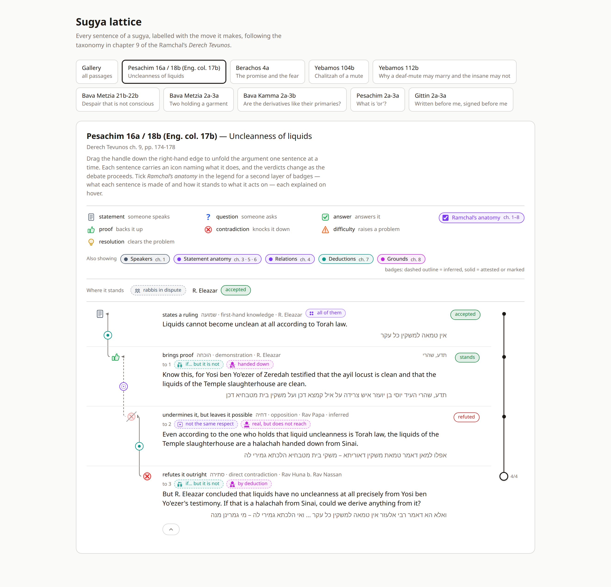
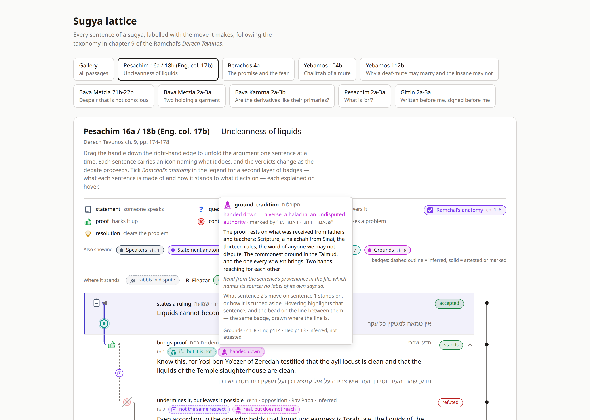
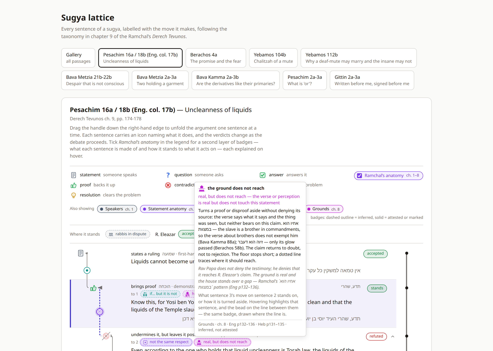
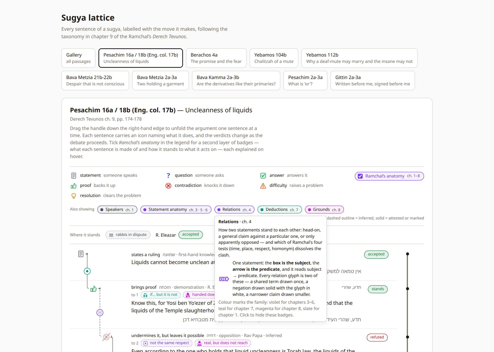
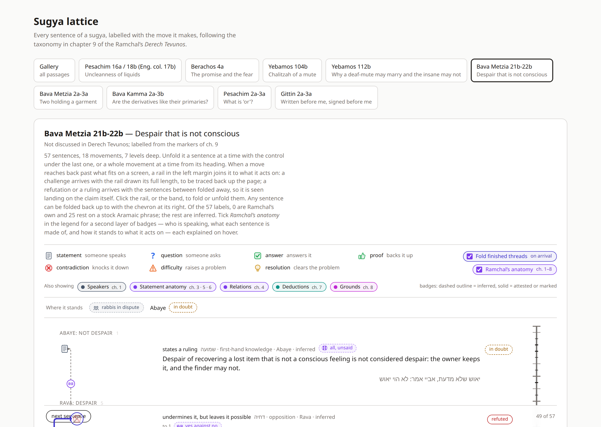
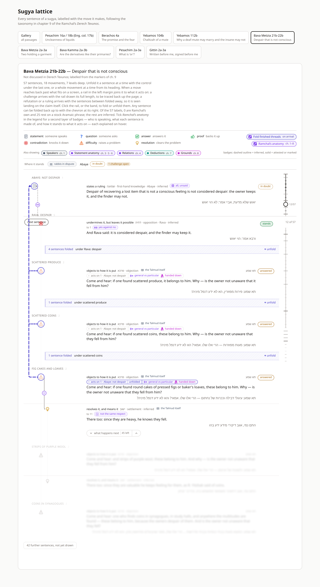
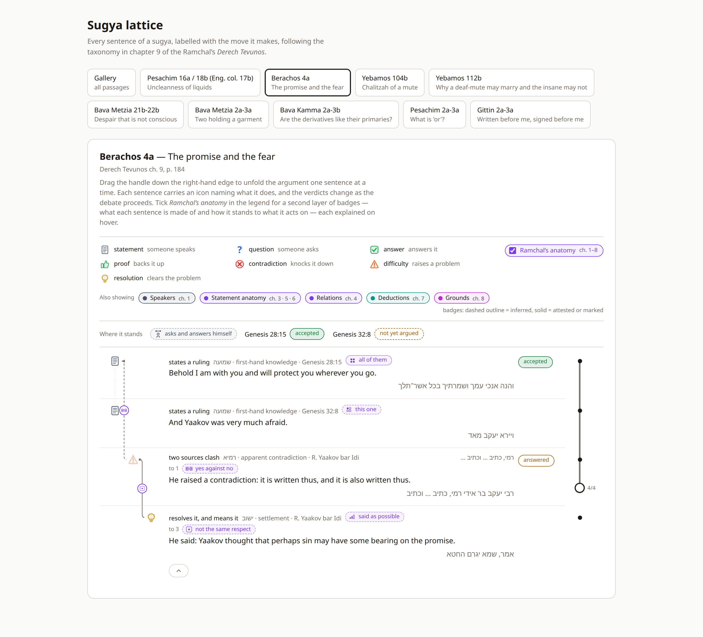

# Sugya Waterfall — v6: Additional Icons

**How the rest of the icon set enters the anatomy layer.** The sixth document
in the series. `SUGYA_WATERFALL_VISUALIZATION_V1.md` gives the chapter 9
taxonomy and the model; `SUGYA_WATERFALL_AT_SCALE_V2.md` records what broke at
fifty-seven sentences; `SUGYA_WATERFALL_V3_RAIL.md` draws the long relation as
a rail; `SUGYA_WATERFALL_V4_ANATOMY.md` lays chapters 1–7 over all of it
without touching the rules; `SUGYA_WATERFALL_V5_FOLD_TREE.md` makes the fold a
tree. This document does not change the rules. It fills the layer v4 left
half-empty: the pictures in `icons_v3/` that the first pass never extracted.

v4 shipped fifty-three glyphs, first-generation bodies, four families. The
current set is seventy-two icons. Seven of those are the chapter 9 moves the
lattice already draws. The rest are anatomy: the fifty-three redrawn, a second
variant, a fourth fallacy, and chapter 8's nine grounds. The format stays
version 1. The rails, folds and chapter 9 icons do not change.

The test cases are the ones the new pictures are about:

> **תדע, שהרי העיד יוסי בן יועזר** — know this, for Yosi ben Yo'ezer testified (Pesachim 16a, the proof)
> **אפילו למאן דאמר משקי בית מטבחיא לא דכן** — even according to the one who holds the Temple liquids are not clean (Pesachim 16a, Rav Papa)
> **ואיסורא דומיא דהיתירא** — and the prohibition resembles the permission (Bava Metzia 22b, sentence 49)

The first is a demonstration from tradition. v4 could name the tollens and
nothing else; the page now also draws a magenta *handed down*. The second does
not deny the testimony — it says the testimony does not reach R. Eleazar's
claim. That is chapter 8's `הקרקע אינה מגיעה`, and it has an icon now. The
third is still an analogism; beside the teal badge sits *by deduction*,
because the refutation brings no new source.

---

## 0. The short version

1. **The glyphs are from `icons_v3`.** `npm run glyphs` (`site/scripts/extract-glyphs.ts`)
   pulls the bodies, replaces hex colours with `currentColor`, and writes
   `site/src/rail/glyphs.ts`. Forty of the old bodies are unchanged. Thirteen
   chapter 4 tiles were redrawn. Eleven kinds are new. Chapter 5's wide
   36×24 icons and every chapter 8 landscape are too busy for a bead: they
   fall back to a dot, as v4's four busy glyphs already did.
2. **`variant` split.** Same subject, two predicates is `variant`. Same
   predicate, two subjects is `variant-subjects`. The agents' guide still
   emits one `variant`; the file picks the icon by which term changes.
3. **A fourth fallacy.** `fallacy-not-included` is the inclusion failure of a
   classical syllogism — the member is not in the kind. Shabbos 43b, sideways
   handling is not handling.
4. **Chapter 8 is a fifth family, magenta.** Nine grounds: four sources of
   certainty (`ground-axiom`, `ground-sense`, `ground-common-sense`,
   `ground-tradition`), deduction, through the opposite, dilemma, the ground
   does not reach, and theory (סברא). Green and red stay verdicts. Magenta
   is only "what this stands on".
5. **Provenance draws a ground.** On a proof, a contradiction or a difficulty
   that acts on something, `sense` / `axiom` / `endoxa` / `tradition` become
   `ground-sense` / `ground-axiom` / `ground-common-sense` /
   `ground-tradition`, inferred. `derivation` and `asserted` do not auto-map
   — the first says only that the sentence must earn its acceptance, not that
   it is a deduction. An explicit chapter 8 label on the unit is the author
   speaking, and it suppresses the derived one.
6. **The chapter 4 tile is a legend, not a kind.** Every relation glyph is two
   of one shape: the box is the subject, the arrow is the predicate. The
   Relations lens tooltip shows the tile once, so the variations can be read.
7. **The format does not step.** Sixty-four kinds instead of fifty-three is
   additive enum growth. Existing files keep drawing. A file that already
   had `provenance: tradition` on a proof now shows a ground badge it did
   not show before; that is the page, not the file, and `version` stays `1`.

When the layer is off the sheet is v5. When it is on, the new family is a
fifth pill in the lens row, on by default, remembered with the rest.

---

## 1. Why these pictures, and not a new layer

Chapter 8 was already in the file. Every unit has `provenance`. The reducer
reads it for the starting status. v4 left it unprinted because there was no
picture for it — the first icon pass stopped at chapter 7.

`icons_v3` draws chapter 8 as one landscape, nine times: a floor seen in
depth, a house built on its horizon. The glyph cut into the floor says which
source; the house's state says the statement's fate. That is a family of
badges, the same shape as a deduction or a relation, not a new sibling key
on the unit. Putting it on `anatomy` keeps the rule v4 set: one layer, one
switch, families as lenses.

The warrant kinds the agents' guide still emits — `proof/indirect`,
`disproof/dilemma`, `rebuttal/irrelevant`, `sevara` — keep their names in
`ext`. The icons have different names because they picture a ground, not a
warrant record. The mapping is in `SUGYA_JSON_FORMAT.md` §7 and in
`DERECH_TEVUNOS_FOR_AGENTS.md` §8.

What still has no icon, and stays in `ext`: premises, `disproof/indirect`,
`disproof/reductio`, the other four `rebuttal/*` kinds, the six `style/*`
kinds, aspect, modality, the twenty-four axes.

---

## 2. The eleven new kinds

*Edge-level, a target required, as every relation and deduction already is.*

| key | family | everyday name | what it pictures |
|---|---|---|---|
| `variant-subjects` | relations | same claim, two subjects | one tall arrow, two boxes — the shared predicate merged |
| `fallacy-not-included` | deductions | not in the kind | a tree with a branch cut off and its member dropped |
| `ground-axiom` | grounds | self-evident | a sun on the floor: ברור כשמש |
| `ground-sense` | grounds | the senses attest | eyes on the floor |
| `ground-common-sense` | grounds | everyone holds it | three heads and shoulders |
| `ground-tradition` | grounds | handed down | two hands reaching for each other |
| `ground-deduction` | grounds | by deduction | an arrow on the floor pointing at the house |
| `via-opposite` | grounds | the opposite fails | two houses on the horizon, one of them struck |
| `dilemma` | grounds | either way, it fails | one road forks, both ways end in a stop bar |
| `ground-does-not-reach` | grounds | real, but does not reach | the floor stops short; a dotted line traces where it should reach |
| `theory` | grounds | inclines, does not prove | the house leans; it has not fallen |

`statement-tile` is not a kind. It is the legend for the chapter 4 family,
shown on the Relations lens.

The four sources of certainty that match `provenance` are usually not
written. Write `ground-deduction`, `via-opposite`, `dilemma`,
`ground-does-not-reach` or `theory` when the page cannot read them off
another field. Pesachim writes `ground-does-not-reach` on Rav Papa and
`ground-deduction` on Rav Huna; Bava Metzia 22b writes `ground-deduction`
on the analogism that knocks Rava down. The testimony's *handed down* is
derived from `provenance: tradition` and is not in the file.

Still unexercised by any shipped passage: `dilemma`, `theory`,
`variant-subjects`, `ground-axiom`, `ground-sense`, `ground-common-sense`.
They are in the vocabulary and the legend and on no row.

---

## 2.1 Gittin 2a–3a, the second worked passage

The research skeletons were `id / move / target / text` and nothing else.
Gittin 2a–3a is now labelled, because a two-sided dispute is where the
anatomy says what chapter 9 cannot.

Chapter 9 draws Rava's move on Rabbah as `דחיה` — one view set against
another, both left merely possible. That is true about the *move* and
misleading about the *statements*: Rabbah and Rava give two different
reasons for one rule, neither denying what the other affirms. Chapter 4
calls that `variant`, and the sugya proves the label by its next word,
`מאי בינייהו` — two reasons that do not clash have to be separated by a
case where they part. The badge and the question now say the same thing.

The two threads are then the same argument run twice, once per side:

| row | label | what it is |
|---|---|---|
| `ליבעי תרי … מידי דהוה א…` | `analogism`, marked | the declaration carried under Torah testimony (Rabbah) or ordinary ratification (Rava) |
| `עד אחד נאמן באיסורין` | `fallacy-not-included` | the inclusion fails: this is a matter of prohibition, not of that kind |
| `אימור דאמרינן … אבל הכא` | `differs-in-context` + `ground-does-not-reach` | the maxim is true and does not reach a matter of ervah |

Both `ליבעי תרי` rows also carry a derived *handed down*, because each
objection leans on received law and the file says so in `provenance`.
`מידי דהוה א…` is the analogism's stock phrase, so those two labels read
**marked** rather than inferred; the Hebrew on those rows was extended to
the clause that carries it, which the skeleton had cut.

Two icons get their first shipped row here. `אם כן ניתני בפני נחתם ותו לא`
is a phrasing argument that concludes `שמע מינה בעינן לשמה` — the claim is
established by the other reading's failure, so `via-opposite` sits beside
the tollens. And Rabbah's `מי דמי?!` is Ramchal's own recognizer for
`fallacy-not-similar`, marked.

Filling in `provenance` changed the page beyond the badges: thirteen units
are `tradition`, so the mishnah now opens **accepted** instead of in doubt,
and every verdict downstream of it is drawn from a truthful starting
status. A skeleton with no `provenance` starts everything in doubt, which
is what a skeleton looks like and not what the Talmud says. The other three
research passages are unchanged and still read that way.

---

## 3. What the page does with `provenance`

`GROUND_OF_PROVENANCE` in `anatomy.ts` is the table:

| `provenance` | derived kind |
|---|---|
| `sense` | `ground-sense` |
| `axiom` | `ground-axiom` |
| `endoxa` | `ground-common-sense` |
| `tradition` | `ground-tradition` |
| `derivation` | — |
| `asserted` | — |

`GROUND_ELEMENTS` is `proof`, `contradiction`, `difficulty`. A resolution
or an answer is about fit, not truth, and a statement or a question opens:
none of those draw a ground from `provenance`, even when the unit is a
verse. The badge is `inferred` — the file records the source as an
editorial judgment, not as a stock word found in the text.

An explicit chapter 8 label anywhere on the unit wins. Rav Papa has
`provenance: tradition` *and* `ground-does-not-reach`; the page shows the
explicit one, not a second *handed down*. That is the pattern the file is
for: when the ground is not the source, write the ground.

---

## 4. Wide glyphs, busy glyphs, magenta

Chapter 5's implication icons are 36×24 in the source. They stay wide on
the chip (`glyphAspect` / `glyphBox` in `Glyph.tsx`); the bead, which is
round and small, cannot hold them, so they join `BUSY_GLYPHS` and draw as a
dot. Every chapter 8 landscape is the same: a floor in perspective is
illegible at bead size.

Magenta is `--magenta` on the palette, one more hue beside violet, teal and
slate. It is not a verdict. A proof from tradition is still a green
*accepted* pill and a magenta *handed down* chip; a disproof that does not
reach is still a red *refuted* on its target and a magenta gap on the
attacker.

A stored lens state that predates the family treats `grounds` as on. A
reader who had turned the layer on keeps the new pill; they can turn it
off.

---

## 5. The format does not step

Version 1, format `derech-tevunos/sugya`. The schema's `kind` enum grew by
eleven names. `parseSugya` counts sixty-four. A file that names none of
them still loads. A file that already had `provenance: tradition` on a
proof now *shows* a badge it did not show — that is derived, the way
standing and the verdict already are, and it is why `version` does not
step.

`SUGYA_JSON_FORMAT.md` §4.2, §4.4, §5.2 and §7 carry the new kinds, the
derivation rule, and the mapping from the agents' guide. The combined
guide's inventory marks `proof/indirect`, `disproof/dilemma`,
`rebuttal/irrelevant` and סברא as **partial**: the icon is present, the
premises stay in `ext`.

---

## 6. What this is not

- **Not a new layer key.** Chapter 8 does not become `warrant` on the unit.
  Premises, aspect and modality still wait in `ext`.
- **Not a change to verdicts.** Magenta does not raise, reject or unsettle.
  The reducer is untouched.
- **Not attested labels.** None of the fixtures' sentences is one Ramchal
  labels in chapters 1–8. The new chips are `inferred`, as v4's were, or
  `marked` where the Talmud's own wording names the form.
- **Not a general re-labelling of the research passages.** Gittin was
  labelled because its dispute needed it. Bava Metzia 2a, Bava Kamma 2a and
  Pesachim 2a are still skeletons and still carry no `provenance`.
- **Not every icon in `icons_v3`.** The seven chapter 9 moves stay in
  `icons.ts`. The tile is legend only. The contact-sheet decorations are
  not kinds.

---

## Appendix — files touched

| File | Change |
|---|---|
| `icons_v3/` | the source set (72 icons). `ICONS_REFERENCE.md` is the contract for using them; `METHODOLOGY.md` is the contract for making them |
| `site/scripts/extract-glyphs.ts` | new — reads the v3 SVGs, strips hex colours, writes `glyphs.ts` |
| `site/src/rail/glyphs.ts` | regenerated: 64 bodies + `TILE_GLYPH`; `WIDE_GLYPHS`; `BUSY_GLYPHS` grown |
| `site/src/rail/anatomy.ts` | `variant-subjects`, `fallacy-not-included`, nine grounds; `Family` includes `grounds`; `Hue` includes `magenta`; `GROUND_OF_PROVENANCE`, `GROUND_ELEMENTS`, `groundBadge` |
| `site/src/rail/theme.ts`, `site/src/rail/app/styles.css` | `--magenta`; lens / badge / tip styles for the fifth family |
| `site/src/rail/app/components/Glyph.tsx` | `glyphAspect`, `glyphBox` — wide chips, square chips |
| `site/src/rail/app/components/BeadLayer.tsx` | uses `glyphBox` |
| `site/src/rail/app/components/LegendBar.tsx` | chapters 1–8; Grounds lens; `TileKey` on the Relations tooltip |
| `site/src/rail/app/components/BadgeTip.tsx` | grounds edge wording |
| `site/src/rail/app/hooks/useAnatomyLayer.ts` | `grounds` default on; a missing stored family defaults on |
| `site/src/rail/app/useSugyaController.ts` | `badgesAt` appends a derived ground last; an explicit ch. 8 label suppresses it |
| `site/src/rail/sugyot/sugya.schema.json` | enum +11 |
| `site/src/rail/format.ts` | comments 64 / chapters 1–8 |
| `site/src/rail/index.ts` | exports the new APIs |
| `site/src/rail/fixtures/pesachim-liquids.ts` | Rav Papa `ground-does-not-reach`; Rav Huna `ground-deduction` |
| `site/src/rail/fixtures/bava-metzia-yeush.ts` | sentence 49 `ground-deduction` |
| `site/src/rail/fixtures/research/skeleton.ts` | `RowTags` carries optional `provenance` and `anatomy` |
| `site/src/rail/fixtures/research/git-2a-befanai.ts` | 19 labels on 16 rows, `provenance` on 25; two rows' Hebrew extended to the `מידי דהוה א…` clause |
| `site/src/rail/check.ts` | 64 types; `groundBadge` cases; fixture asserts |
| `SUGYA_JSON_FORMAT.md` | §4.2, §4.4, §5.2, §7 |
| `DERECH_TEVUNOS_FOR_AGENTS.md` | §0, §6, §8 visualization keys |
| `DERECH_TEVUNOS_SUGYA_JSON_GUIDE.md` | inventory, vocabularies, Layer D, checklist |
| `README.md`, `AGENTS.md` | the v6 pointer; `npm run glyphs` |
