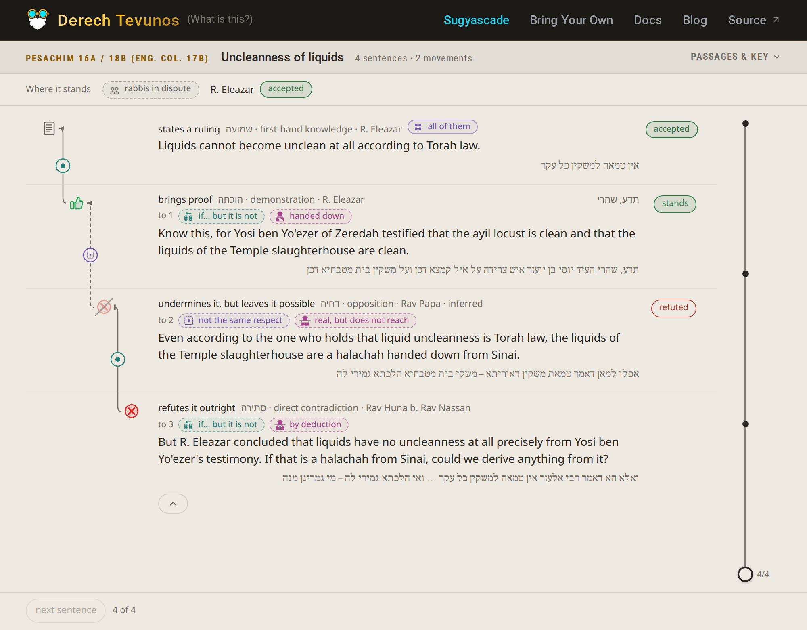
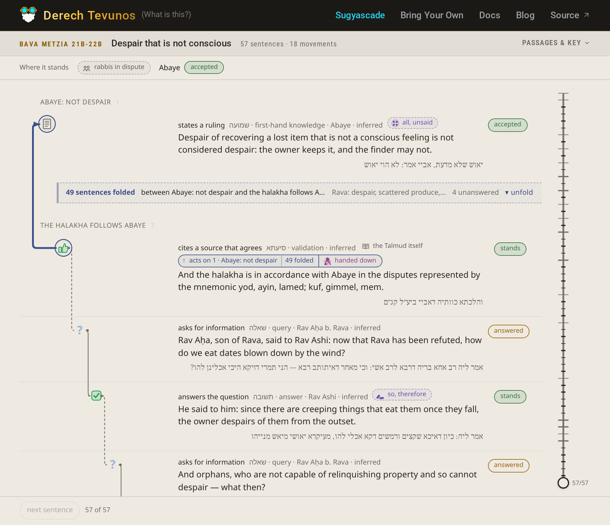
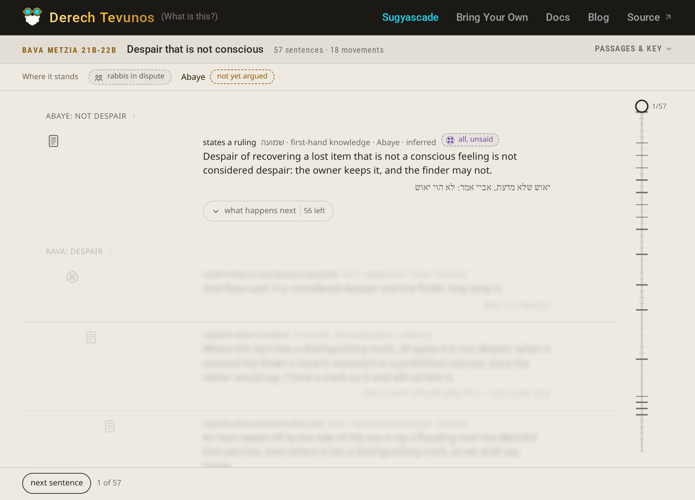

In short

*Derech Tevunos* is a procedure: closed vocabularies, a test for each label
against its nearest neighbour, and a fixed rule for what every move does to the
claim it lands on. Running it by hand costs hours per page, which is why a sound
method sat unused. That cost is what changed, and with this site i hope to show it.

4 sentences of Aramaic in *Shabbos* 5b.

12 steps underneath them, and not one of the 12 is written in the Gemara.

Ramchal counts them out in chapter 10: two claims, four syllogisms, one
elucidation, reconstructed line by line until every premise lands on something
nobody argues with. Then he says the thing that has bothered me for years. Leave
one step out and you have not understood the argument.

He is right, and look at what being right costs. Four sentences took him pages.
The longest passage I labelled for this site runs [77 sentences](/sugya/bk-2a-toldos),
and that is two dapim of *Bava Kamma*.

## The Sefer I own and did not learn

If anybody was equipped to finish this one it was me. I write software, I like
logic systems the way other people like crosswords, and I went through the whole
Semantic Web era like it was a parade: RDF, OWL, description logics, triple
stores, ontologies, knowledge bases. I have owned *Derech Tevunos* for 10 years
and I have not finished it.

I bought it because Ramchal wrote it. I learned *Mesillas Yesharim*, like
everybody. I learned *Derech Hashem*. This one I have opened dozens of times,
and dozens of times I got a few pages in and put it back on the shelf 
shortly afterward.

A dense treatise of pure logic with nothing to look at is very hard to process,
and there is not one diagram in the sefer. Those 12 steps under the 4 sentences of
*Shabbos* 5b are a picture, and they arrive as prose, in order, each one leaning
on something a paragraph back. So you draw it yourself, in your head, on every
page, and it goes when you close the book. Every attempt ended the same way: I
could tell you the method was sound and not what it had just proved.

## What is in it

*Derech Tevunos* is a specification.

Chapter 9 takes every sentence a sugya can contain and gives it a name: 7
elements, 19 leaves, each one a thing a sentence does to a sentence before it,
each with a test that separates it from the label sitting next to it. Chapter 3
says that whatever the surface was, a question, a flourish, an ellipsis you
finish in your head, the claim underneath is a subject and a predicate in one of
11 manners, and you put it in that form before you do anything else with it.
Chapter 4 says how two statements can stand to each other, including the case
where two Tannaim look like they are arguing and are not. Chapter 11 gives 24
<bdi lang="he">הבחנות</bdi>, the d

Chapter upon chapter of prose builds up a taxonomy that can classify every sugya
in existence because the Ramchal can hold the entire Gemara in his head at the
same time. Once you can classify a sugya you can build visuals on top of it so
logic flow is a thing that can be eyeballed. Choose a classification system
that is format enough and the visuals can have mechanics, and mechanics
mean demonstrability via playing around. That was the dream! 

## Why nobody runs it

The procedure is sound, but too expensive.

*Bava Metzia* 21b to 22b runs 57 sentences. Abaye states a claim in the first
one, it comes under attack 10 separate times over the next 33 rows, and the
support that finally lands on it sits in row 51. Labelling that by hand, every
label naming the row it acts on, is an afternoon. Then you have one page.

There is a second problem sitting under the first one. A Talmid Chacham already
does most of this in his head, fast, with no names for any of it. The person
equipped to produce the labels has no use for them, and the person who would
gain from them cannot pay for them. A method whose only qualified users have
already outgrown it does not go anywhere.

## What changed

The expensive half got cheap.

The question a model answers here is narrow. What does this sentence do to the
sentence before it? The answer has to be one of 19 labels, it has to name the
sentence it acts on, and it has to survive Ramchal's own test for telling that
label from its siblings. An answer outside the vocabulary fails
validation and the file never draws. That is clerical work against a closed
list, which is the kind of work LLMs are quote reliable at.

So I ran it. There are 9 passages on this site, 5 of Ramchal's own examples and
4 opening sugyot. It got things wrong, or at least inconsistent which is
understandable for LLMs. More importantly, the original translators of
Derech Tevunos themselves explain that parsing a sugya can never and will
never be absolutely deterministic. We've already accepted all of this
decades ago.

What makes it categorically better today is the drawing. A sentence labelled wrong
takes the picture with it: a resolution floating with nothing above it to
resolve. You catch it before you have finished reading the row.

## The drawing is doing more work than the labels

Here's a fact of life: Very few people are interested in the deep analysis of 
dialectical process. 
A great many people are interested in a well-made drawing with a good icon set. I
am on the third generation of the icon set, and that is where the reach is.

If this sefer gets used, it will be because somebody saw the shape of an
argument, found it beautiful, and got curious about what produced it.

## What I am not claiming

The machine sorts sentences into categories a person specified. It does not
learn, it has no Yiras Shamayim, and it replaces no Rebbi, no Chavrusa and no
Beis Medrash. The purpose of all of this is as an aid. Nothing more.

## The site

The homepage opens on a passage instead of an index, because the drawing is the
thing. It is 4 sentences from *Pesachim* 16a and 18b, the shortest of the examples
Ramchal works through himself: R. Eleazar says liquids cannot become unclean by Torah law,
a proof from Yosi ben Yo'ezer's testimony lands under it, and Rav Huna answers.
Ramchal labels two of those four himself, in chapter 9, so the drawing of this one
can be checked against the sefer that specified it.

<figure>

<figcaption>All 4 sentences revealed. Every row carries its label on the left (states a ruling, brings proof, undermines it but leaves it possible, refutes it outright), the sentence in English with the Hebrew under it, and where the claim stands on the right. The little <em>to 1</em>, <em>to 2</em>, <em>to 3</em> handles are which sentence the move acts on, and the elbow beside them draws the same thing.</figcaption>

</figure>

The drawing is called **Sugyascade**, which is the link in the nav: sugya plus
cascade, because a cascade descends over a series of ledges, which is the shape,
and because each stage of one is set off by the stage above it, which is the
argument.

That reads fine at 4 sentences. The opening sugyot run to 36, 57 and 77, and there
the sentence a move acts on can be 30 rows above it, which is what the rail and the
fold are for.

<figure>

<figcaption><em>Bava Metzia</em> 21b to 22b, 57 sentences, the passage this post keeps citing. Abaye's ruling is row 1, and the blue rail down the left gutter runs from it to the support that finally lands on it, in row 51. The band between them holds the 49 rows it skipped and still reports what happened in there: 4 unanswered. Unfold and all 49 come back.</figcaption>

</figure>

A rail runs up the gutter rather than through the rows, in a colour no verdict
uses, so following one is never confused with the red of a refutation or the amber
of a doubt. A fold keeps the result of the stretch it closes over, which is what
makes it safe to read past. The bar above the rows holds the state of play, every
claim and where it currently stands.

Nothing below the frontier is readable: a row or two of blur, then nothing
rendered at all.

<figure>

<figcaption>The same <em>Bava Metzia</em> passage, on arrival. One sentence is readable. The next rows are blur, and then the drawing stops: 53 sentences are not in the page. The control on the right sits at 1/57.</figcaption>

</figure>

The control beside the rows moves that frontier one sentence at a time, which is
how a sugya arrives when you learn it, and it is the only way I have found to
read a passage I have not seen before without the ending spoiling the middle.

[/sugya](/sugya) has all 9, and [/docs](/docs) has the sefer, Hebrew and English,
all 11 chapters, with [chapter 9](/docs/text/chapter-09) as the vocabulary the
drawing reads.

[/byo](/byo) draws a file you labelled yourself. Drop it or paste it and it is parsed and
drawn by the code that draws these 9, so what the page accepts and what the site
ships are the same format by construction. Nothing is
uploaded: the file lives in your tab and the parse runs there. A file it refuses
prints every fault at once, each with its path in the JSON.

If something is broken, or a label looks wrong to you, I want to hear about it. I
am [@deusaquilus](https://x.com/deusaquilus) on X and
[aioffe](https://www.linkedin.com/in/aioffe/) on LinkedIn.
